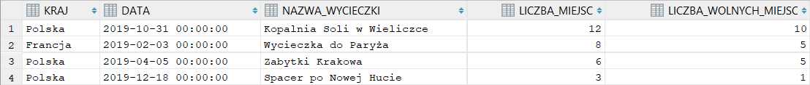

# PL/SQL &ndash; programowanie proceduralne, widoki, procedury, triggery</big>
## Tomasz Zawadzki

### 1. Tabele
Wycieczki (id_wycieczki, nazwa, kraj, data, opis, liczba_miejsc)
Osoby(id_osoby, imie, nazwisko, pesel, kontakt)
Rezerwacje(nr_rezerwacji, id_wycieczki, id_osoby, status)
Pole status w tabeli Rezerwacje może przyjmować jedną z 4 wartości:
* N – Nowa
* P – Potwierdzona
* Z – Potwierdzona i zapłacona
* A – Anulowana

Uruchomione zostały wszystkie zapytania z pliku `wyc.sql`.

### 2. Wypełniamy tabele przykładowymi danymi

#### 4 wycieczki
```sql
INSERT INTO wycieczki (nazwa, kraj, data, opis, liczba_miejsc)
  VALUES ('Wycieczka do Paryża', 'Francja',
    TO_DATE('2019-02-03', 'YYYY-MM-DD'), 'Ciekawa wycieczka...', 8);

INSERT INTO wycieczki (nazwa, kraj, data, opis, liczba_miejsc)
  VALUES ('Zabytki Krakowa', 'Polska',
    TO_DATE('2019-04-05', 'YYYY-MM-DD'), 'Najciekawsza wycieczka...', 6);

INSERT INTO wycieczki (nazwa, kraj, data, opis, liczba_miejsc)
  VALUES ('Kopalnia Soli w Wieliczce', 'Polska',
    TO_DATE('2019-10-31', 'YYYY-MM-DD'), 'Najstarsza kopalnia...', 12);

INSERT INTO wycieczki (nazwa, kraj, data, opis, liczba_miejsc)
  VALUES ('Spacer po Nowej Hucie', 'Polska',
    TO_DATE('2019-12-18', 'YYYY-MM-DD'), 'Zadziwiająca dzielnica...', 20);
```

<div style="page-break-after: always;"></div>

```sql
SELECT * FROM wycieczki;
```


#### 10 osób
```sql
INSERT INTO osoby (imie, nazwisko, pesel, kontakt)
  VALUES ('Jan', 'Kowalski', '95100318445', 'e-mail: jan.kowalski@onet.pl');

INSERT INTO osoby (imie, nazwisko, pesel, kontakt)
  VALUES ('Anna', 'Nowak', '76010958491', 'e-mail: anna.nowak@op.pl');

INSERT INTO osoby (imie, nazwisko, pesel, kontakt)
  VALUES ('Piotr', 'Kowalczyk', '96092127123', 'e-mail: piotr.kowalczyk@gmail.com');

INSERT INTO osoby (imie, nazwisko, pesel, kontakt)
  VALUES ('Szymon', 'Wójcik', '48032821419', 'e-mail: szymon.wojcik@wp.pl');

INSERT INTO osoby (imie, nazwisko, pesel, kontakt)
  VALUES ('Paweł', 'Woźniak', '73101366476', 'e-mail: pawel.wozniak@gmail.com');

INSERT INTO osoby (imie, nazwisko, pesel, kontakt)
  VALUES ('Maria', 'Dąbrowska', '85092556697', 'tel. (012) 266-27-65');

INSERT INTO osoby (imie, nazwisko, pesel, kontakt)
  VALUES ('Kamil', 'Jankowski', '44091338215', 'tel. 32-456-54-67');

INSERT INTO osoby (imie, nazwisko, pesel, kontakt)
  VALUES ('Katarzyna', 'Pawłowska', '03272721671', 'tel. (012) 234-75-34');

INSERT INTO osoby (imie, nazwisko, pesel, kontakt)
  VALUES ('Zbigniew', 'Jabłońska', '57022888163', 'tel. (012) 792-34-56');

INSERT INTO osoby (imie, nazwisko, pesel, kontakt)
  VALUES ('Wojciech', 'Król', '61083155836', 'tel. (012) 234-44-44');
```
```sql
SELECT * FROM osoby;
```


#### 10 rezerwacji
```sql
INSERT INTO rezerwacje(id_wycieczki, id_osoby, status) VALUES (1, 1, 'N');
INSERT INTO rezerwacje(id_wycieczki, id_osoby, status) VALUES (1, 2, 'P');
INSERT INTO rezerwacje(id_wycieczki, id_osoby, status) VALUES (1, 3, 'Z');
INSERT INTO rezerwacje(id_wycieczki, id_osoby, status) VALUES (1, 4, 'A');
INSERT INTO rezerwacje(id_wycieczki, id_osoby, status) VALUES (2, 3, 'N');
INSERT INTO rezerwacje(id_wycieczki, id_osoby, status) VALUES (3, 4, 'N');
INSERT INTO rezerwacje(id_wycieczki, id_osoby, status) VALUES (3, 5, 'Z');
INSERT INTO rezerwacje(id_wycieczki, id_osoby, status) VALUES (4, 6, 'N');
INSERT INTO rezerwacje(id_wycieczki, id_osoby, status) VALUES (4, 7, 'Z');
INSERT INTO rezerwacje(id_wycieczki, id_osoby, status) VALUES (4, 8, 'A');
```
```sql
SELECT * FROM rezerwacje;
```


### 3. Tworzenie widoków
Należy przygotować kilka widoków ułatwiających dostęp do danych.

Każdy podpunkt został zrealizowany na dwa sposoby:
* **wersja standardowa** – widok jest tworzony na podstawie zapytania SQL odwołującego się jedynie do istniejących tabel. Wadą tego rozwiązania jest brak spójności oraz duplikacja fragmentów zapytań odpowiedzialnych za realizację logiki biznesowej.
* **wersja z widokiem pośrednim/z wykorzystaniem innych widoków** – widok jest tworzony na podstawie tabel lub istniejących już widoków.
Widoki z sufiksem `_id` zawierają dodatkowo kolumny z identyfikatorami wycieczek, osób lub rezerwacji i są wykorzystywane do złączeń. Metoda ta pozwala pozbyć się potwórzeń fragmentów zapytań dotyczących logiki biznesowej.

#### a) wycieczki_osoby(kraj, data, nazwa_wycieczki, imie, nazwisko, status_rezerwacji)
Na podstawie przykładu z pliku `wyc_proc.sql` przyjmuję założenie, że anulowane rezerwacje również powinny być wyświetlane. W przeciwnym wypadku, zapytanie należy rozszerzyć o warunek `r.status != 'A'`.

<div style="page-break-after: always;"></div>

##### Wersja standardowa:
```sql
CREATE OR REPLACE VIEW wycieczki_osoby AS
  SELECT
    w.kraj,
    w.data,
    w.nazwa AS nazwa_wycieczki,
    o.imie,
    o.nazwisko,
    r.status AS status_rezerwacji
  FROM wycieczki w
    JOIN rezerwacje r ON w.id_wycieczki = r.id_wycieczki
    JOIN osoby o ON r.id_osoby = o.id_osoby;
```
##### Wersja z widokiem pośrednim:
```sql
CREATE OR REPLACE VIEW wycieczki_osoby_id AS
  SELECT
    w.id_wycieczki,
    w.kraj,
    w.data,
    w.nazwa AS nazwa_wycieczki,
    o.id_osoby,
    o.imie,
    o.nazwisko,
    o.kontakt,
    r.nr_rezerwacji,
    r.status AS status_rezerwacji
  FROM wycieczki w
    JOIN rezerwacje r ON w.id_wycieczki = r.id_wycieczki
    JOIN osoby o ON r.id_osoby = o.id_osoby;

CREATE OR REPLACE VIEW wycieczki_osoby AS
  SELECT kraj, data, nazwa_wycieczki, imie, nazwisko, status_rezerwacji
  FROM wycieczki_osoby_id;
```
```sql
SELECT * FROM wycieczki_osoby;
```


<div style="page-break-after: always;"></div>

#### b) wycieczki_osoby_potwierdzone(kraj, data, nazwa_wycieczki, imie, nazwisko, status_rezerwacji)
##### Wersja standardowa:
```sql
CREATE OR REPLACE VIEW wycieczki_osoby_potwierdzone AS
  SELECT *
  FROM wycieczki_osoby
  WHERE status_rezerwacji IN ('P', 'Z');
```
##### Wersja z wykorzystaniem innych widoków:
```sql
CREATE OR REPLACE VIEW wycieczki_osoby_potwierdzone_id AS
  SELECT *
  FROM wycieczki_osoby_id
  WHERE status_rezerwacji IN ('P', 'Z');

CREATE OR REPLACE VIEW wycieczki_osoby_potwierdzone AS
  SELECT kraj, data, nazwa_wycieczki, imie, nazwisko, status_rezerwacji
  FROM wycieczki_osoby_potwierdzone_id;
```
```sql
SELECT * FROM wycieczki_osoby_potwierdzone;
```


<div style="page-break-after: always;"></div>

#### c) wycieczki_przyszle(kraj, data, nazwa_wycieczki, imie, nazwisko, status_rezerwacji)
##### Wersja standardowa:
```sql
CREATE OR REPLACE VIEW wycieczki_przyszle AS
  SELECT
    w.kraj,
    w.data,
    w.nazwa AS nazwa_wycieczki,
    o.imie,
    o.nazwisko,
    r.status AS status_rezerwacji
  FROM wycieczki w
    JOIN rezerwacje r ON w.id_wycieczki = r.id_wycieczki
    JOIN osoby o ON r.id_osoby = o.id_osoby
  WHERE
    w.data > SYSDATE;
```

##### Wersja z wykorzystaniem innych widoków:
```sql
CREATE OR REPLACE VIEW wycieczki_przyszle_id AS
  SELECT *
  FROM wycieczki_osoby_id
  WHERE data > SYSDATE;

CREATE OR REPLACE VIEW wycieczki_przyszle AS
  SELECT kraj, data, nazwa_wycieczki, imie, nazwisko, status_rezerwacji
  FROM wycieczki_przyszle_id;
```
```sql
SELECT * FROM wycieczki_przyszle;
```


<div style="page-break-after: always;"></div>

#### d) wycieczki_miejsca(kraj, data, nazwa_wycieczki, liczba_miejsc, liczba_wolnych_miejsc)
##### Wersja standardowa:
```sql
CREATE OR REPLACE VIEW wycieczki_miejsca AS
  SELECT
    w.kraj,
    w.data,
    w.nazwa AS nazwa_wycieczki,
    w.liczba_miejsc,
    (w.liczba_miejsc - COUNT(r.nr_rezerwacji)) AS liczba_wolnych_miejsc
  FROM wycieczki w
    JOIN rezerwacje r
      ON w.id_wycieczki = r.id_wycieczki
      AND r.status != 'A'
  GROUP BY
    w.id_wycieczki, w.kraj, w.data, w.nazwa, w.liczba_miejsc;
```
##### Wersja z widokiem pośrednim:
```sql
CREATE OR REPLACE VIEW wycieczki_miejsca_id AS
  SELECT
    w.id_wycieczki,
    w.kraj,
    w.data,
    w.nazwa AS nazwa_wycieczki,
    w.liczba_miejsc,
    (w.liczba_miejsc - COUNT(r.nr_rezerwacji)) AS liczba_wolnych_miejsc
  FROM wycieczki w
    JOIN rezerwacje r
      ON w.id_wycieczki = r.id_wycieczki
      AND r.status != 'A'
  GROUP BY
    w.id_wycieczki, w.kraj, w.data, w.nazwa, w.liczba_miejsc;

CREATE OR REPLACE VIEW wycieczki_miejsca AS
  SELECT kraj, data, nazwa_wycieczki, liczba_miejsc, liczba_wolnych_miejsc
  FROM wycieczki_miejsca_id;
```
```sql
SELECT * FROM wycieczki_miejsca;
```


<div style="page-break-after: always;"></div>

#### e) dostępne_wycieczki(kraj, data, nazwa_wycieczki, liczba_miejsc, liczba_wolnych_miejsc)
##### Wersja standardowa:
```sql
CREATE OR REPLACE VIEW dostepne_wycieczki AS
  SELECT
    w.kraj,
    w.data,
    w.nazwa AS nazwa_wycieczki,
    w.liczba_miejsc,
    (w.liczba_miejsc - COUNT(r.nr_rezerwacji)) AS liczba_wolnych_miejsc
  FROM wycieczki w
    JOIN rezerwacje r ON w.id_wycieczki = r.id_wycieczki
  WHERE
    w.data > SYSDATE
  GROUP BY
    w.id_wycieczki, w.kraj, w.data, w.nazwa, w.liczba_miejsc
  HAVING
    (w.liczba_miejsc - COUNT(r.nr_rezerwacji)) > 0;
```
##### Wersja z wykorzystaniem innych widoków:
```sql
CREATE OR REPLACE VIEW dostepne_wycieczki_id AS
  SELECT *
  FROM wycieczki_miejsca_id
  WHERE liczba_wolnych_miejsc > 0 AND data > SYSDATE;

CREATE OR REPLACE VIEW dostepne_wycieczki AS
  SELECT kraj, data, nazwa_wycieczki, liczba_miejsc, liczba_wolnych_miejsc
  FROM dostepne_wycieczki_id;
```
```sql
SELECT * FROM dostepne_wycieczki;
```


<div style="page-break-after: always;"></div>

#### f) rezerwacje_do_anulowania – lista niepotwierdzonych rezerwacji, które powinne zostać anulowane, rezerwacje przygotowywane są do anulowania na tydzień przed wyjazdem
##### Wersja standardowa:
```sql
CREATE OR REPLACE VIEW rezerwacje_do_anulowania AS
  SELECT
    w.kraj,
    w.data,
    w.nazwa AS nazwa_wycieczki,
    o.imie,
    o.nazwisko,
    o.kontakt
  FROM rezerwacje r
    JOIN wycieczki w ON w.id_wycieczki = r.id_wycieczki
    JOIN osoby o ON o.id_osoby = r.id_osoby
  WHERE
    r.status = 'N' AND w.data BETWEEN SYSDATE AND SYSDATE + INTERVAL '7' DAY;
```
##### Wersja z wykorzystaniem innych widoków:
```sql
CREATE OR REPLACE VIEW rezerwacje_do_anulowania_id AS
  SELECT *
  FROM wycieczki_osoby_id
  WHERE status_rezerwacji = 'N' AND data BETWEEN SYSDATE AND SYSDATE + INTERVAL '7' DAY;

CREATE OR REPLACE VIEW rezerwacje_do_anulowania AS
  SELECT kraj, data, nazwa_wycieczki, imie, nazwisko, kontakt
  FROM rezerwacje_do_anulowania_id;
```
```sql
SELECT * FROM rezerwacje_do_anulowania;
```


Proponowany zestaw widoków można rozbudować wedle uznania/potrzeb.

<div style="page-break-after: always;"></div>

### 4. Tworzenie procedur/funkcji pobierających dane
Podobnie jak w poprzednim przykładzie należy przygotować kilka procedur ułatwiających dostęp do danych. Procedury/funkcje powinny zwracać tabelę/zbiór wynikowy. Należy zwrócić uwagę na kontrolę parametrów (np. jeśli parametrem jest id_wycieczki to należy sprawdzić czy taka wycieczka istnieje).

Utworzyłem procedury pomocnicze, które sprawdzają, czy osoba, wycieczka albo rezerwacja o podanym identyfikatorze istnieje w bazie danych. Procedury te działają jak asercje (tzn. przerywają działanie procedury wywołującej i zwracają błąd, gdy warunek nie jest spełniony).

Aby nie dublować logiki biznesowej, funkcje pobierające dane korzystają ze zdefiniowanych uprzednio widoków z sufiksem `_id` (tzn. zawierających kolumny identyfikatorów).

Prodecury odpowiadają również za kontrolę argumentów. Oto kompletna lista kodów zdefiniowanych błędów:

| Kod | Opis |
| :-: | :- |
| -20001 | Osoba o podanym identyfikatorze nie istnieje |
| -20002 | Wycieczka o podanym identyfikatorze nie istnieje |
| -20003 | Rezerwacja o podanym numerze nie istnieje |
| -20004 | Początek przedziału dat nie może być później niż koniec |
| -20005 | Wycieczka już się odbyła |
| -20006 | Brak wolnych miejsc |
| -20007 | Liczba miejsc musi być dodatnią liczbą naturalną |
| -20008 | Liczba miejsc nie może być mniejsza niż liczba zajętych miejsc |
| -20009 | Nie można usuwać rezerwacji |

<div style="page-break-after: always;"></div>

#### sprawdz_czy_osoba_istnieje(id_osoby)
```sql
CREATE OR REPLACE PROCEDURE sprawdz_czy_osoba_istnieje(
  arg_id_osoby osoby.id_osoby%TYPE
) AS
  osoby_count INTEGER;
BEGIN
  SELECT COUNT(*)
    INTO osoby_count
    FROM osoby
    WHERE id_osoby = arg_id_osoby;

  IF osoby_count = 0 THEN
    RAISE_APPLICATION_ERROR(-20001, 'Osoba o podanym identyfikatorze nie istnieje');
  END IF;
END;
```

#### sprawdz_czy_wycieczka_istnieje(id_wycieczki)
```sql
CREATE OR REPLACE PROCEDURE sprawdz_czy_wycieczka_istnieje(
  arg_id_wycieczki wycieczki.id_wycieczki%TYPE
) AS
  wycieczki_count INTEGER;
BEGIN
  SELECT COUNT(*)
    INTO wycieczki_count
    FROM wycieczki
    WHERE id_wycieczki = arg_id_wycieczki;

  IF wycieczki_count = 0 THEN
    RAISE_APPLICATION_ERROR(-20002, 'Wycieczka o podanym identyfikatorze nie istnieje');
  END IF;
END;
```

#### sprawdz_czy_rezerwacja_istnieje(nr_rezerwacji)
```sql
CREATE OR REPLACE PROCEDURE sprawdz_czy_rezerwacja_istnieje(
  arg_nr_rezerwacji rezerwacje.nr_rezerwacji%TYPE
) AS
  rezerwacje_count INTEGER;
BEGIN
  SELECT COUNT(*)
    INTO rezerwacje_count
    FROM rezerwacje
    WHERE nr_rezerwacji = arg_nr_rezerwacji;

  IF rezerwacje_count = 0 THEN
    RAISE_APPLICATION_ERROR(-20003, 'Rezerwacja o podanym numerze nie istnieje');
  END IF;
END;
```

<div style="page-break-after: always;"></div>

#### a) uczestnicy_wycieczki(id_wycieczki)
Procedura ma zwracać podobny zestaw danych jak widok wycieczki_osoby.
```sql
CREATE OR REPLACE TYPE uczestnik_wycieczki_type AS
  OBJECT (
    imie VARCHAR2(50),
    nazwisko VARCHAR2(50),
    status_rezerwacji CHAR(1)
  );

CREATE OR REPLACE TYPE uczestnicy_wycieczki_table_type AS
  TABLE OF uczestnik_wycieczki_type;

CREATE OR REPLACE FUNCTION uczestnicy_wycieczki(arg_id_wycieczki wycieczki.id_wycieczki%TYPE)
RETURN uczestnicy_wycieczki_table_type PIPELINED
AS
BEGIN
  sprawdz_czy_wycieczka_istnieje(arg_id_wycieczki);

  FOR row IN (
    SELECT *
    FROM wycieczki_osoby_id
    WHERE id_wycieczki = arg_id_wycieczki AND status_rezerwacji != 'A'
  ) LOOP
    PIPE ROW (uczestnik_wycieczki_type(
      row.imie, row.nazwisko, row.status_rezerwacji
    ));
  END LOOP;
  RETURN;
END;
```
```sql
SELECT * FROM TABLE(uczestnicy_wycieczki(1));
```


<div style="page-break-after: always;"></div>

#### b) rezerwacje_osoby(id_osoby)
Procedura ma zwracać podobny zestaw danych jak widok wycieczki_osoby.

Analogicznie jak w przypadku widoku wycieczki_osoby przyjąłem założenie, że anulowane rezerwacje również powinny być zwracane. W przeciwnym wypadku należy wzbogacić zapytanie o warunek `status_rezerwacji != 'A'`.
```sql
CREATE OR REPLACE TYPE rezerwacja_osoby_type AS
  OBJECT (
    kraj VARCHAR2(50),
    data DATE,
    nazwa_wycieczki VARCHAR(100),
    status_rezerwacji CHAR(1)
  );

CREATE OR REPLACE TYPE rezerwacje_osoby_table_type AS
  TABLE OF rezerwacja_osoby_type;

CREATE OR REPLACE FUNCTION rezerwacje_osoby(arg_id_osoby osoby.id_osoby%TYPE)
RETURN rezerwacje_osoby_table_type PIPELINED
AS
BEGIN
  sprawdz_czy_osoba_istnieje(arg_id_osoby);

  FOR row IN (
    SELECT *
    FROM wycieczki_osoby_id
    WHERE id_osoby = arg_id_osoby
  ) LOOP
    PIPE ROW (rezerwacja_osoby_type(
      row.kraj, row.data, row.nazwa_wycieczki, row.status_rezerwacji
    ));
  END LOOP;
  RETURN;
END;
```
```sql
SELECT * FROM TABLE(rezerwacje_osoby(3));
```


<div style="page-break-after: always;"></div>

#### c) przyszle_rezerwacje_osoby(id_osoby)
Działa analogicznie jak wycieczki_osoby, z tą różnicą, że zwraca jedynie rezerwacje wycieczek, które jeszcze się nie odbyły.
```sql
CREATE OR REPLACE FUNCTION przyszle_rezerwacje_osoby(arg_id_osoby osoby.id_osoby%TYPE)
RETURN rezerwacje_osoby_table_type PIPELINED
AS
BEGIN
  sprawdz_czy_osoba_istnieje(arg_id_osoby);

  FOR row IN (
    SELECT *
    FROM wycieczki_przyszle_id
    WHERE id_osoby = arg_id_osoby
  ) LOOP
    PIPE ROW (rezerwacja_osoby_type(
      row.kraj, row.data, row.nazwa_wycieczki, row.status_rezerwacji
    ));
  END LOOP;
  RETURN;
END;
```
```sql
SELECT * FROM TABLE(przyszle_rezerwacje_osoby(4));
```


<div style="page-break-after: always;"></div>

#### d) dostepne_wycieczki(kraj, data_od, data_do)
Z uwagi na fakt, że istnieje już widok o nazwie `dostepne_wycieczki`, konieczna była zmiana nazwy tej funkcji na `dostepne_wycieczki_funkcja`.
```sql
CREATE OR REPLACE TYPE wycieczka_type AS
  OBJECT (
    kraj VARCHAR2(50),
    data DATE,
    nazwa_wycieczki VARCHAR2(100),
    liczba_miejsc INTEGER,
    liczba_wolnych_miejsc INTEGER
  );

CREATE OR REPLACE TYPE wycieczki_table_type AS
  TABLE OF wycieczka_type;

CREATE OR REPLACE FUNCTION dostepne_wycieczki_funkcja(
  arg_kraj wycieczki.kraj%TYPE,
  arg_data_od wycieczki.data%TYPE,
  arg_data_do wycieczki.data%TYPE
) RETURN wycieczki_table_type PIPELINED
AS
BEGIN
  IF arg_data_do < arg_data_od THEN
    RAISE_APPLICATION_ERROR(-20004,
      'Początek przedziału dat nie może być później niż koniec');
  END IF;

  FOR row IN (
    SELECT *
    FROM dostepne_wycieczki
    WHERE kraj = arg_kraj AND data BETWEEN arg_data_od AND arg_data_do
  ) LOOP
    PIPE ROW (wycieczka_type(row.kraj, row.data, row.nazwa_wycieczki,
      row.liczba_miejsc, row.liczba_wolnych_miejsc));
  END LOOP;
  RETURN;
END;
```
```sql
SELECT * FROM TABLE(dostepne_wycieczki_funkcja('Polska',
  TO_DATE('2019-10-01', 'YYYY-MM-DD'), TO_DATE('2019-10-31', 'YYYY-MM-DD')));
```


<div style="page-break-after: always;"></div>

### 5. Tworzenie procedur modyfikujących dane
Należy przygotować zestaw procedur pozwalających na modyfikację danych oraz kontrolę poprawności ich wprowadzania. Należy rozważyć użycie transakcji. Należy zwrócić uwagę na kontrolę parametrów (np. jeśli parametrem jest id_wycieczki to należy sprawdzić czy taka wycieczka istnieje, jeśli robimy rezerwację to należy sprawdzać czy są wolne miejsca).

Utworzyłem kolejne procedury pomocnicze, które działają jak asercje (przerywają działanie procedury wywołującej i zwracają błąd, gdy warunek nie jest spełniony).

#### sprawdz_czy_wycieczka_jeszcze_sie_nie_odbyla(id_wycieczki)
```sql
CREATE OR REPLACE PROCEDURE sprawdz_czy_wycieczka_jeszcze_sie_nie_odbyla(
  arg_id_wycieczki wycieczki.id_wycieczki%TYPE
) AS
  wycieczki_count INTEGER;
BEGIN
  SELECT COUNT(*)
    INTO wycieczki_count
    FROM wycieczki
    WHERE id_wycieczki = arg_id_wycieczki AND data > SYSDATE;

  IF wycieczki_count = 0 THEN
    RAISE_APPLICATION_ERROR(-20005, 'Wycieczka już się odbyła');
  END IF;
END;
```

#### sprawdz_czy_jest_wolne_miejsce(id_wycieczki)
```sql
CREATE OR REPLACE PROCEDURE sprawdz_czy_jest_wolne_miejsce(
  arg_id_wycieczki wycieczki.id_wycieczki%TYPE
) AS
  liczba_wolnych_miejsc INTEGER;
BEGIN
  SELECT liczba_wolnych_miejsc
    INTO liczba_wolnych_miejsc
    FROM wycieczki_miejsca_id
    WHERE id_wycieczki = arg_id_wycieczki;

  IF liczba_wolnych_miejsc <= 0 THEN
    RAISE_APPLICATION_ERROR(-20006, 'Brak wolnych miejsc');
  END IF;
END;
```

<div style="page-break-after: always;"></div>

#### sprawdz_czy_nie_istnieje_rezerwacja(id_wycieczki, id_osoby)
```sql
CREATE OR REPLACE PROCEDURE sprawdz_czy_nie_istnieje_rezerwacja(
  arg_id_wycieczki wycieczki.id_wycieczki%TYPE,
  arg_id_osoby osoby.id_osoby%TYPE
) AS
  rezerwacje_count INTEGER;
BEGIN
  SELECT COUNT(*)
    INTO rezerwacje_count
    FROM rezerwacje
    WHERE id_wycieczki = arg_id_wycieczki AND id_osoby = arg_id_osoby;

  IF rezerwacje_count > 0 THEN
    RAISE_APPLICATION_ERROR(-20006, 'Rezerwacja już istnieje.');
  END IF;
END;
```

#### a) dodaj_rezerwacje(id_wycieczki, id_osoby)
Procedura powinna kontrolować czy wycieczka jeszcze się nie odbyła i czy są wolne miejsca.
```sql
CREATE OR REPLACE PROCEDURE dodaj_rezerwacje(
  arg_id_wycieczki wycieczki.id_wycieczki%TYPE,
  arg_id_osoby osoby.id_osoby%TYPE
) AS
BEGIN
  sprawdz_czy_wycieczka_istnieje(arg_id_wycieczki);
  sprawdz_czy_wycieczka_jeszcze_sie_nie_odbyla(arg_id_wycieczki);
  sprawdz_czy_jest_wolne_miejsce(arg_id_wycieczki);
  sprawdz_czy_osoba_istnieje(arg_id_osoby);
  sprawdz_czy_nie_istnieje_rezerwacja(arg_id_wycieczki, arg_id_osoby);

  INSERT INTO rezerwacje (id_wycieczki, id_osoby, status)
    VALUES (arg_id_wycieczki, arg_id_osoby, 'N');
END;
```

<div style="page-break-after: always;"></div>

#### b) zmien_status_rezerwacji(nr_rezerwacji, status)
Procedura kontrolować czy możliwa jest zmiana statusu, np. zmiana statusu już anulowanej wycieczki (przywrócenie do stanu aktywnego nie zawsze jest możliwe).
```sql
CREATE OR REPLACE PROCEDURE zmien_status_rezerwacji(
  arg_nr_rezerwacji rezerwacje.nr_rezerwacji%TYPE,
  arg_status rezerwacje.status%TYPE
) AS
  current_status rezerwacje.status%TYPE;
  current_id_wycieczki wycieczki.id_wycieczki%TYPE;
BEGIN
  sprawdz_czy_rezerwacja_istnieje(arg_nr_rezerwacji);

  SELECT status
    INTO current_status
    FROM rezerwacje
    WHERE nr_rezerwacji = arg_nr_rezerwacji;

  IF current_status != arg_status THEN
    IF current_status = 'A' AND arg_status != 'A' THEN
      SELECT id_wycieczki
        INTO current_id_wycieczki
        FROM rezerwacje
        WHERE nr_rezerwacji = arg_nr_rezerwacji;

      sprawdz_czy_jest_wolne_miejsce(current_id_wycieczki);
    END IF;

    UPDATE rezerwacje
      SET status = arg_status
      WHERE nr_rezerwacji = arg_nr_rezerwacji;
  END IF;
END;
```

<div style="page-break-after: always;"></div>

#### c) zmien_liczbe_miejsc(id_wycieczki, liczba_miejsc)
Nie wszystkie zmiany liczby miejsc są dozwolone, nie można zmniejszyć liczby miejsc na wartość poniżej liczby zarezerwowanych miejsc.
```sql
CREATE OR REPLACE PROCEDURE zmien_liczbe_miejsc(
  arg_id_wycieczki wycieczki.id_wycieczki%TYPE,
  arg_liczba_miejsc INTEGER
) AS
  liczba_zajetych_miejsc integer;
BEGIN
  IF arg_liczba_miejsc <= 0 THEN
    RAISE_APPLICATION_ERROR(-20007, 'Liczba miejsc musi być dodatnią liczbą naturalną');
  END IF;
  sprawdz_czy_wycieczka_istnieje(arg_id_wycieczki);

  SELECT (liczba_miejsc - liczba_wolnych_miejsc)
    INTO liczba_zajetych_miejsc
    FROM wycieczki_miejsca_id
    WHERE id_wycieczki = arg_id_wycieczki;

  IF arg_liczba_miejsc < liczba_zajetych_miejsc THEN
    RAISE_APPLICATION_ERROR(-20008, =
      'Liczba miejsc nie może być mniejsza niż liczba zajętych miejsc');
  END IF;

  UPDATE wycieczki
    SET liczba_miejsc = arg_liczba_miejsc
    WHERE id_wycieczki = arg_id_wycieczki;
END;
```

<div style="page-break-after: always;"></div>

### 6. Dodajemy tabelę dziennikującą zmiany statusu rezerwacji rezerwacje_log(id, id_rezerwacji, data, status)
```sql
CREATE TABLE rezerwacje_log (
  id INT GENERATED ALWAYS AS IDENTITY NOT NULL,
  id_rezerwacji INT,
  data DATE,
  status CHAR(1),
  CONSTRAINT rezerwacje_log_pk PRIMARY KEY (id) ENABLE
);

ALTER TABLE rezerwacje_log
  ADD CONSTRAINT rezerwacje_log_fk1
    FOREIGN KEY (id_rezerwacji)
      REFERENCES rezerwacje (nr_rezerwacji) ENABLE;

ALTER TABLE rezerwacje_log
  ADD CONSTRAINT rezerwacje_log_chk1
    CHECK (status IN ('N', 'P', 'Z', 'A')) ENABLE;
```
Należy zmienić warstwę procedur modyfikujących dane tak aby dopisywały informację do dziennika.

#### dodaj_rezerwacje(id_wycieczki, id_osoby)
```sql
CREATE OR REPLACE PROCEDURE dodaj_rezerwacje(
  arg_id_wycieczki wycieczki.id_wycieczki%TYPE,
  arg_id_osoby osoby.id_osoby%TYPE
) AS
  inserted_nr_rezerwacji rezerwacje.nr_rezerwacji%TYPE;
  inserted_status rezerwacje.status%TYPE;
BEGIN
  sprawdz_czy_wycieczka_istnieje(arg_id_wycieczki);
  sprawdz_czy_wycieczka_jeszcze_sie_nie_odbyla(arg_id_wycieczki);
  sprawdz_czy_jest_wolne_miejsce(arg_id_wycieczki);
  sprawdz_czy_osoba_istnieje(arg_id_osoby);
  sprawdz_czy_nie_istnieje_rezerwacja(arg_id_wycieczki, arg_id_osoby);

  INSERT INTO rezerwacje (id_wycieczki, id_osoby, status)
    VALUES (arg_id_wycieczki, arg_id_osoby, 'N')
    RETURNING nr_rezerwacji, status INTO inserted_nr_rezerwacji, inserted_status;

  INSERT INTO rezerwacje_log (id_rezerwacji, data, status)
    VALUES (inserted_nr_rezerwacji, SYSDATE, inserted_status);
END;
```

<div style="page-break-after: always;"></div>

#### zmien_status_rezerwacji(nr_rezerwacji, status)
```sql
CREATE OR REPLACE PROCEDURE zmien_status_rezerwacji(
  arg_nr_rezerwacji rezerwacje.nr_rezerwacji%TYPE,
  arg_status rezerwacje.status%TYPE
) AS
  current_status rezerwacje.status%TYPE;
  current_id_wycieczki wycieczki.id_wycieczki%TYPE;
BEGIN
  sprawdz_czy_rezerwacja_istnieje(arg_nr_rezerwacji);

  SELECT status, id_wycieczki
    INTO current_status, current_id_wycieczki
    FROM rezerwacje
    WHERE nr_rezerwacji = arg_nr_rezerwacji;

  IF current_status != arg_status THEN
    IF current_status = 'A' AND arg_status != 'A' THEN
      sprawdz_czy_jest_wolne_miejsce(current_id_wycieczki);
    END IF;

    UPDATE rezerwacje
      SET status = arg_status
      WHERE nr_rezerwacji = arg_nr_rezerwacji;

    INSERT INTO rezerwacje_log (id_rezerwacji, data, status)
      VALUES (arg_nr_rezerwacji, SYSDATE, arg_status);
  END IF;
END;
```

<div style="page-break-after: always;"></div>

### 7. Zmiana struktury bazy danych, w tabeli wycieczki dodajemy redundantne pole liczba_wolnych_miejsc
```sql
ALTER TABLE wycieczki ADD liczba_wolnych_miejsc INT DEFAULT 0 NOT NULL;
```

Należy zmodyfikować zestaw widoków. Proponuję dodać kolejne widoki (np. z sufiksem 2), które pobierają informację o wolnych miejscach z nowo dodanego pola.

#### wycieczki_miejsca_2
```sql
CREATE OR REPLACE VIEW wycieczki_miejsca_2 AS
  SELECT kraj, data, nazwa AS nazwa_wycieczki, liczba_miejsc, liczba_wolnych_miejsc
  FROM wycieczki;
```

#### dostepne_wycieczki_2
```sql
CREATE OR REPLACE VIEW dostepne_wycieczki_2 AS
  SELECT kraj, data, nazwa AS nazwa_wycieczki, liczba_miejsc, liczba_wolnych_miejsc
  FROM wycieczki
  WHERE liczba_wolnych_miejsc > 0 AND data > SYSDATE;
```

Należy napisać procedurę przelicz, która zaktualizuje wartość liczby wolnych miejsc dla już istniejących danych.
#### przelicz()
```sql
CREATE OR REPLACE PROCEDURE przelicz AS
BEGIN
  UPDATE wycieczki w
  SET liczba_wolnych_miejsc = liczba_miejsc - (
    SELECT COUNT(*)
      FROM rezerwacje r
      WHERE r.id_wycieczki = w.id_wycieczki AND r.status != 'A');
END;
```
```sql
CALL przelicz();
```

<div style="page-break-after: always;"></div>

Należy zmodyfikować warstwę procedur pobierających dane, podobnie jak w przypadku widoków.

#### dostepne_wycieczki_funkcja_2(kraj, data_od, data_do)
```sql
CREATE OR REPLACE FUNCTION dostepne_wycieczki_funkcja_2(
  arg_kraj wycieczki.kraj%TYPE,
  arg_data_od wycieczki.data%TYPE,
  arg_data_do wycieczki.data%TYPE
) RETURN wycieczki_table_type PIPELINED
AS
BEGIN
  IF arg_data_do < arg_data_od THEN
    RAISE_APPLICATION_ERROR(-20004,
      'Początek przedziału dat nie może być później niż koniec');
  END IF;

  FOR row IN (
    SELECT *
    FROM dostepne_wycieczki_2
    WHERE kraj = arg_kraj AND data BETWEEN arg_data_od AND arg_data_do
  ) LOOP
    PIPE ROW (wycieczka_type(row.kraj, row.data, row.nazwa_wycieczki,
      row.liczba_miejsc, row.liczba_wolnych_miejsc));
  END LOOP;
  RETURN;
END;
```

Należy zmodyfikować procedury wprowadzające dane tak aby korzystały/aktualizowały pole liczba_wolnych_miejsc w tabeli wycieczki. Najlepiej to zrobić tworząc nowe wersje (np. z sufiksem 2).
#### sprawdz_czy_jest_wolne_miejsce_2(id_wycieczki)
```sql
CREATE OR REPLACE PROCEDURE sprawdz_czy_jest_wolne_miejsce_2(
  arg_id_wycieczki wycieczki.id_wycieczki%TYPE
) AS
  liczba_wolnych_miejsc INTEGER;
BEGIN
  SELECT liczba_wolnych_miejsc
    INTO liczba_wolnych_miejsc
    FROM wycieczki
    WHERE id_wycieczki = arg_id_wycieczki;

  IF liczba_wolnych_miejsc <= 0 THEN
    RAISE_APPLICATION_ERROR(-20006, 'Brak wolnych miejsc');
  END IF;
END;
```

<div style="page-break-after: always;"></div>

#### dodaj_rezerwacje_2(id_wycieczki, id_osoby)
```sql
CREATE OR REPLACE PROCEDURE dodaj_rezerwacje_2(
  arg_id_wycieczki wycieczki.id_wycieczki%TYPE,
  arg_id_osoby osoby.id_osoby%TYPE
) AS
  inserted_nr_rezerwacji rezerwacje.nr_rezerwacji%TYPE;
  inserted_status rezerwacje.status%TYPE;
BEGIN
  sprawdz_czy_wycieczka_istnieje(arg_id_wycieczki);
  sprawdz_czy_wycieczka_jeszcze_sie_nie_odbyla(arg_id_wycieczki);
  sprawdz_czy_jest_wolne_miejsce_2(arg_id_wycieczki);
  sprawdz_czy_osoba_istnieje(arg_id_osoby);
  sprawdz_czy_nie_istnieje_rezerwacja(arg_id_wycieczki, arg_id_osoby);

  INSERT INTO rezerwacje (id_wycieczki, id_osoby, status)
    VALUES (arg_id_wycieczki, arg_id_osoby, 'N')
    RETURNING nr_rezerwacji, status INTO inserted_nr_rezerwacji, inserted_status;

  UPDATE wycieczki
    SET liczba_wolnych_miejsc = liczba_wolnych_miejsc - 1
    WHERE id_wycieczki = arg_id_wycieczki;

  INSERT INTO rezerwacje_log (id_rezerwacji, data, status)
    VALUES (inserted_nr_rezerwacji, SYSDATE, inserted_status);
END;
```

<div style="page-break-after: always;"></div>

#### zmien_status_rezerwacji_2(nr_rezerwacji, status)
```sql
CREATE OR REPLACE PROCEDURE zmien_status_rezerwacji_2(
  arg_nr_rezerwacji rezerwacje.nr_rezerwacji%TYPE,
  arg_status rezerwacje.status%TYPE
) AS
  current_status rezerwacje.status%TYPE;
  current_id_wycieczki wycieczki.id_wycieczki%TYPE;
BEGIN
  sprawdz_czy_rezerwacja_istnieje(arg_nr_rezerwacji);

  SELECT status, id_wycieczki
    INTO current_status, current_id_wycieczki
    FROM rezerwacje
    WHERE nr_rezerwacji = arg_nr_rezerwacji;

  IF current_status != arg_status THEN
    IF current_status != 'A' AND arg_status = 'A' THEN
      UPDATE wycieczki
        SET liczba_wolnych_miejsc = liczba_wolnych_miejsc + 1
        WHERE id_wycieczki = current_id_wycieczki;
    ELSIF current_status = 'A' AND arg_status != 'A' THEN
      sprawdz_czy_jest_wolne_miejsce_2(current_id_wycieczki);

      UPDATE wycieczki
        SET liczba_wolnych_miejsc = liczba_wolnych_miejsc - 1
        WHERE id_wycieczki = current_id_wycieczki;
    END IF;

    UPDATE rezerwacje
      SET status = arg_status
      WHERE nr_rezerwacji = arg_nr_rezerwacji;

    INSERT INTO rezerwacje_log (id_rezerwacji, data, status)
      VALUES (arg_nr_rezerwacji, SYSDATE, arg_status);
  END IF;
END;
```

<div style="page-break-after: always;"></div>

#### zmien_liczbe_miejsc_2(id_wycieczki, liczba_miejsc)
```sql
CREATE OR REPLACE PROCEDURE zmien_liczbe_miejsc_2(
  arg_id_wycieczki wycieczki.id_wycieczki%TYPE,
  arg_liczba_miejsc INTEGER
) AS
  liczba_zajetych_miejsc integer;
BEGIN
  IF arg_liczba_miejsc <= 0 THEN
    RAISE_APPLICATION_ERROR(-20007, 'Liczba miejsc musi być dodatnią liczbą naturalną');
  END IF;
  sprawdz_czy_wycieczka_istnieje(arg_id_wycieczki);

  SELECT (liczba_miejsc - liczba_wolnych_miejsc)
    INTO liczba_zajetych_miejsc
    FROM wycieczki
    WHERE id_wyciecki = arg_id_wycieczki;

  IF arg_liczba_miejsc < liczba_zajetych_miejsc THEN
    RAISE_APPLICATION_ERROR(-20008,
      'Liczba miejsc nie może być mniejsza niż liczba zajętych miejsc');
  END IF;

  UPDATE wycieczki
    SET liczba_miejsc = arg_liczba_miejsc,
      liczba_wolnych_miejsc = (arg_liczba_miejsc - liczba_zajetych_miejsc)
    WHERE id_wycieczki = arg_id_wycieczki;
END;
```

<div style="page-break-after: always;"></div>

### 8. Zmiana strategii zapisywania do dziennika rezerwacji. Realizacja przy pomocy triggerów
Należy wprowadzić zmianę która spowoduje, że zapis do dziennika rezerwacji będzie realizowany przy pomocy triggerów.
Oczywiście po wprowadzeniu tej zmiany należy uaktualnić procedury modyfikujące dane. Najlepiej to zrobić tworząc nowe wersje (np. z sufiksem 3).

#### Trigger obsługujący dodanie rezerwacji
```sql
CREATE OR REPLACE TRIGGER rezerwacje_after_insert
AFTER INSERT ON rezerwacje FOR EACH ROW
BEGIN
  INSERT INTO rezerwacje_log (id_rezerwacji, data, status)
    VALUES (:NEW.nr_rezerwacji, SYSDATE, :NEW.status);
END;
```

#### dodaj_rezerwacje_3(id_wycieczki, id_osoby)
```sql
CREATE OR REPLACE PROCEDURE dodaj_rezerwacje_3(
  arg_id_wycieczki wycieczki.id_wycieczki%TYPE,
  arg_id_osoby osoby.id_osoby%TYPE
) AS
BEGIN
  sprawdz_czy_wycieczka_istnieje(arg_id_wycieczki);
  sprawdz_czy_wycieczka_jeszcze_sie_nie_odbyla(arg_id_wycieczki);
  sprawdz_czy_jest_wolne_miejsce_2(arg_id_wycieczki);
  sprawdz_czy_osoba_istnieje(arg_id_osoby);
  sprawdz_czy_nie_istnieje_rezerwacja(arg_id_wycieczki, arg_id_osoby);

  INSERT INTO rezerwacje (id_wycieczki, id_osoby, status)
    VALUES (arg_id_wycieczki, arg_id_osoby, 'N');

  UPDATE wycieczki
    SET liczba_wolnych_miejsc = liczba_wolnych_miejsc - 1
    WHERE id_wycieczki = arg_id_wycieczki;
END;
```

#### Trigger zabraniający usunięcia rezerwacji
```sql
CREATE OR REPLACE TRIGGER rezerwacje_before_delete
BEFORE DELETE ON rezerwacje FOR EACH ROW
BEGIN
  RAISE_APPLICATION_ERROR(-20009, 'Nie można usuwać rezerwacji');
END;
```

<div style="page-break-after: always;"></div>

#### Trigger obsługujący zmianę statusu
```sql
CREATE OR REPLACE TRIGGER rezerwacje_after_update
AFTER UPDATE ON rezerwacje FOR EACH ROW
BEGIN
  INSERT INTO rezerwacje_log (id_rezerwacji, data, status)
    VALUES (:NEW.nr_rezerwacji, SYSDATE, :NEW.status);
END;
```

#### zmien_status_rezerwacji_3(nr_rezerwacji, status)
```sql
CREATE OR REPLACE PROCEDURE zmien_status_rezerwacji_3(
  arg_nr_rezerwacji rezerwacje.nr_rezerwacji%TYPE,
  arg_status rezerwacje.status%TYPE
) AS
  current_status rezerwacje.status%TYPE;
  current_id_wycieczki wycieczki.id_wycieczki%TYPE;
BEGIN
  sprawdz_czy_rezerwacja_istnieje(arg_nr_rezerwacji);

  SELECT status, id_wycieczki
    INTO current_status, current_id_wycieczki
    FROM rezerwacje
    WHERE nr_rezerwacji = arg_nr_rezerwacji;

  IF current_status != arg_status THEN
    IF current_status = 'A' AND arg_status != 'A' THEN
      sprawdz_czy_jest_wolne_miejsce_2(current_id_wycieczki);

      UPDATE wycieczki
        SET liczba_wolnych_miejsc = liczba_wolnych_miejsc - 1
        WHERE id_wycieczki = current_id_wycieczki;
    ELSIF current_status != 'A' AND arg_status = 'A' THEN
      UPDATE wycieczki
        SET liczba_wolnych_miejsc = liczba_wolnych_miejsc + 1
        WHERE id_wycieczki = current_id_wycieczki;
    END IF;

    UPDATE rezerwacje
      SET status = arg_status
      WHERE nr_rezerwacji = arg_nr_rezerwacji;
  END IF;
END;
```

<div style="page-break-after: always;"></div>

### 9. Zmiana strategii obsługi redundantnego pola liczba_wolnych_miejsc. Realizacja przy pomocy triggerów
Oczywiście po wprowadzeniu tej zmiany należy uaktualnić procedury modyfikujące dane. Najlepiej to zrobić tworząc nowe wersje (np. z sufiksem 4).

#### Trigger obsługujący dodanie rezerwacji
```sql
CREATE OR REPLACE TRIGGER rezerwacje_before_insert
BEFORE INSERT ON rezerwacje FOR EACH ROW
BEGIN
  sprawdz_czy_wycieczka_istnieje(:NEW.id_wycieczki);
  sprawdz_czy_wycieczka_jeszcze_sie_nie_odbyla(:NEW.id_wycieczki);
  sprawdz_czy_jest_wolne_miejsce_2(:NEW.id_wycieczki);
  sprawdz_czy_osoba_istnieje(:NEW.id_osoby);
  sprawdz_czy_nie_istnieje_rezerwacja(:NEW.id_wycieczki, :NEW.id_osoby);
END;
```
```sql
CREATE OR REPLACE TRIGGER rezerwacje_after_insert
AFTER INSERT ON rezerwacje FOR EACH ROW
BEGIN
  INSERT INTO rezerwacje_log (id_rezerwacji, data, status)
    VALUES (:NEW.nr_rezerwacji, SYSDATE, :NEW.status);

  UPDATE wycieczki
    SET liczba_wolnych_miejsc = liczba_wolnych_miejsc - 1
    WHERE id_wycieczki = :NEW.id_wycieczki;
END;
```

#### dodaj_rezerwacje_4(id_wycieczki, id_osoby)
```sql
CREATE OR REPLACE PROCEDURE dodaj_rezerwacje_4(
  arg_id_wycieczki wycieczki.id_wycieczki%TYPE,
  arg_id_osoby osoby.id_osoby%TYPE
) AS
BEGIN
  INSERT INTO rezerwacje (id_wycieczki, id_osoby, status)
    VALUES (arg_id_wycieczki, arg_id_osoby, 'N');
END;
```

<div style="page-break-after: always;"></div>

#### Trigger obsługujący zmianę statusu
```sql
CREATE OR REPLACE TRIGGER rezerwacje_before_update
BEFORE UPDATE ON rezerwacje FOR EACH ROW
BEGIN
  IF :OLD.status != :NEW.status THEN
    IF :OLD.status = 'A' AND :NEW.status != 'A' THEN
      sprawdz_czy_jest_wolne_miejsce_2(:NEW.id_wycieczki);

      UPDATE wycieczki
        SET liczba_wolnych_miejsc = liczba_wolnych_miejsc - 1
        WHERE id_wycieczki = :NEW.id_wycieczki;
    ELSIF :OLD.status != 'A' AND :NEW.status = 'A' THEN
      UPDATE wycieczki
        SET liczba_wolnych_miejsc = liczba_wolnych_miejsc + 1
        WHERE id_wycieczki = :NEW.id_wycieczki;
    END IF;
  END IF;
END;
```
```sql
CREATE OR REPLACE TRIGGER rezerwacje_after_update
AFTER UPDATE ON rezerwacje FOR EACH ROW
BEGIN
  INSERT INTO rezerwacje_log (id_rezerwacji, data, status)
    VALUES (:NEW.nr_rezerwacji, SYSDATE, :NEW.status);
END;
```

#### zmien_status_rezerwacji_4(nr_rezerwacji, status)
```sql
CREATE OR REPLACE PROCEDURE zmien_status_rezerwacji_4(
  arg_nr_rezerwacji rezerwacje.nr_rezerwacji%TYPE,
  arg_status rezerwacje.status%TYPE
) AS
  current_status rezerwacje.status%TYPE;
  current_id_wycieczki wycieczki.id_wycieczki%TYPE;
BEGIN
  sprawdz_czy_rezerwacja_istnieje(arg_nr_rezerwacji);

  UPDATE rezerwacje
    SET status = arg_status
    WHERE nr_rezerwacji = arg_nr_rezerwacji;
END;
```

<div style="page-break-after: always;"></div>

#### Trigger obsługujący zmianę liczby miejsc na poziomie wycieczki
```sql
CREATE OR REPLACE TRIGGER wycieczki_before_update
BEFORE UPDATE ON wycieczki FOR EACH ROW
BEGIN
  IF :NEW.liczba_miejsc <= 0 THEN
    RAISE_APPLICATION_ERROR(-20007,
      'Liczba miejsc musi być dodatnią liczbą naturalną');
  END IF;

  IF :NEW.liczba_miejsc < (:OLD.liczba_miejsc - :NEW.liczba_wolnych_miejsc) THEN
    RAISE_APPLICATION_ERROR(-20008,
      'Liczba miejsc nie może być mniejsza niż liczba zajętych miejsc');
  END IF;

  SELECT :NEW.liczba_miejsc - (:OLD.liczba_miejsc - :NEW.liczba_wolnych_miejsc)
    INTO :NEW.liczba_wolnych_miejsc
    FROM dual;
END;
```

#### zmien_liczbe_miejsc_4(id_wycieczki, liczba_miejsc)
```sql
CREATE OR REPLACE PROCEDURE zmien_liczbe_miejsc_4(
  arg_id_wycieczki wycieczki.id_wycieczki%TYPE,
  arg_liczba_miejsc INTEGER
) AS
BEGIN
  sprawdz_czy_wycieczka_istnieje(arg_id_wycieczki);

  UPDATE wycieczki
    SET liczba_miejsc = arg_liczba_miejsc
    WHERE id_wycieczki = arg_id_wycieczki;
END;
```
