# Entity Framework, LINQ2Entities
## Tomasz Zawadzki

Pierwsza część sprawozdania zawiera rozwiązania zadań z punktu instrukcji **V. Method syntax vs query syntax**, którego nie zdążyłem zrealizować podczas laboratorium.

Druga część sprawozdania opisuje aplikację przygotowaną jako zadanie domowe. Zawiera ona fragmenty kodu źródłowego, zrzuty ekranu oraz krótki opis wykorzystanych mechanizmów.

---

### V. Method syntax vs query syntax

#### Methoda pobierająca i wypisująca nazwy kategorii
```cs
private static void ShowCategories(ProdContext db)
{
    IQueryable<String> categoriesNamesQuery = db.Categories.Select(c => c.Name);
    foreach (var name in categoriesNamesQuery)
    {
        Console.WriteLine(name);
    }
}
```

Wynik uruchomienia poniższego programu:
```cs
using (var db = new ProdContext())
{
    ShowCategories(db);
    Console.ReadKey();
}
```
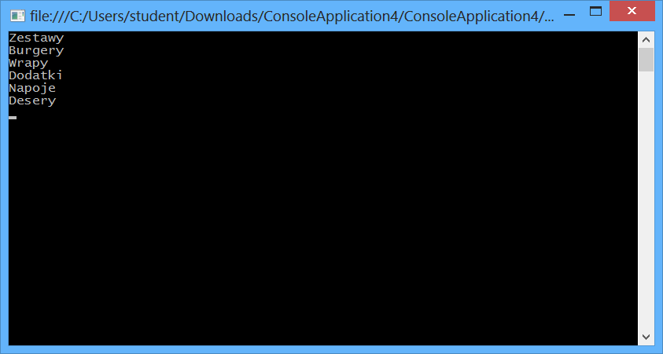

Po osiągnięciu breakpointa przy definicji pierwszego zapytania program został wykonany krokowo. SQL Profiler wyświetlił następującą sekwencję zapytań:

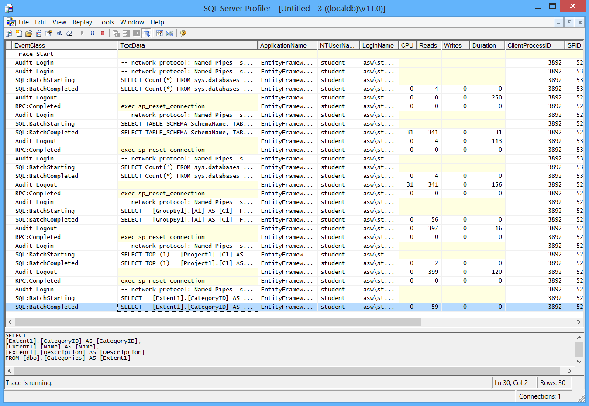

<div style="page-break-after: always;"></div>

#### Metody pobierające i wyświetlające wszystkie kategorie i produkty

##### Joiny, query syntax
```cs
static void ShowCategoriesProducts_Join_QuerySyntax(ProdContext db)
{
    var query = from category in db.Categories
                join product in db.Products
                on category.CategoryID equals product.CategoryID
                select new
                {
                    Category = category,
                    Product = product
                };

    foreach (var row in query) {
        Console.WriteLine("{0} ({1})", row.Product.Name, row.Category.Name);
    }
}
```

##### Joiny, method syntax
```cs
static void ShowCategoriesProducts_Join_MethodSyntax(ProdContext db)
{
    var query = db.Categories.Join(
        db.Products,
        product => product.CategoryID,
        category => category.CategoryID,
        (category, product) => new
        {
            Category = category,
            Product = product
        });

    foreach (var row in query)
    {
        Console.WriteLine("{0} ({1})", row.Product.Name, row.Category.Name);
    }
}
```

##### Navigation property, lazy loading, query syntax
```cs
static void ShowCategoriesProducts_NavigationProperty_LazyLoading_QuerySyntax(ProdContext db)
{
    var categoriesQuery = from category in db.Categories select category;
    foreach (var category in categoriesQuery)
    {
        foreach (var product in category.Products)
        {
            Console.WriteLine("{0} ({1})", product.Name, category.Name);
        }
    }
}
```

##### Navigation property, lazy loading, method syntax
```cs
static void ShowCategoriesProducts_NavigationProperty_LazyLoading_MethodSyntax(ProdContext db)
{
    foreach (var category in db.Categories)
    {
        foreach (var product in category.Products)
        {
            Console.WriteLine("{0} ({1})", product.Name, category.Name);
        }
    }
}
```

##### Navigation property, eager loading, query syntax
```cs
static void ShowCategoriesProducts_NavigationProperty_EagerLoading_QuerySyntax(ProdContext db)
{
    var categoriesQuery = from category in db.Categories
                          select new
                          {
                              Category = category,
                              Products = category.Products
                          };
    foreach (var category in categoriesQuery)
    {
        foreach (var product in category.Products)
        {
            Console.WriteLine("{0} ({1})", product.Name, category.Category.Name);
        }
    }
}
```

##### Navigation property, eager loading, method syntax
```cs
static void ShowCategoriesProducts_NavigationProperty_EagerLoading_MethodSyntax(ProdContext db)
{
    var categoriesQuery = db.Categories.Include(c => c.Products);
    foreach (var category in categoriesQuery)
    {
        foreach (var product in category.Products)
        {
            Console.WriteLine("{0} ({1})", product.Name, category.Name);
        }
    }
}
```

<div style="page-break-after: always;"></div>

Wynik uruchomienia poniższego programu:
```cs
using (var db = new ProdContext())
{
    ShowCategoriesProducts_QuerySyntax_Join(db);
    Console.ReadKey();
}
```
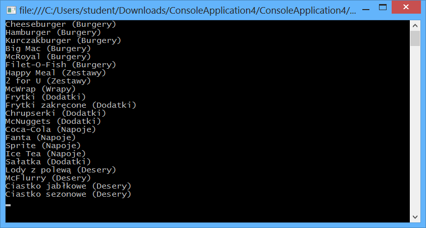

<div style="page-break-after: always;"></div>

#### Methoda wyświetlająca wszystkie kategorie wraz z liczbą produktów

##### Query syntax
```cs
static void ShowCategoriesWithProductsCount_QuerySyntax(ProdContext db)
{
    var query = from category in db.Categories
                join product in db.Products
                on category.CategoryID equals product.CategoryID
                into productsGroup
                select new
                {
                    Category = category,
                    ProductsCount = productsGroup.Count()
                };

    foreach (var row in query)
    {
        Console.WriteLine("{0} ({1})", row.Category.Name, row.ProductsCount);
    }
}
```

##### Method syntax
```cs
static void ShowCategoriesWithProductsCount_QuerySyntax(ProdContext db)
{
    var query = from category in db.Categories
                join product in db.Products
                on category.CategoryID equals product.CategoryID
                into productsGroup
                select new
                {
                    Category = category,
                    ProductsCount = productsGroup.Count()
                };

    foreach (var row in query)
    {
        Console.WriteLine("{0} ({1})", row.Category.Name, row.ProductsCount);
    }
}
```

<div style="page-break-after: always;"></div>

Wynik uruchomienia poniższego programu:
```cs
using (var db = new ProdContext())
{
    ShowCategoriesWithProductsCount_MethodSyntax(db);
    // ShowCategoriesWithProductsCount_QuerySyntax(db);
    Console.ReadKey();
}
```
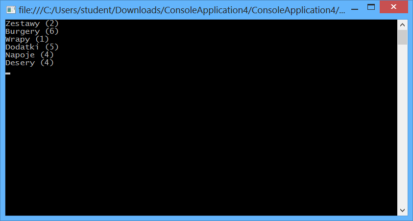

<div style="page-break-after: always;"></div>

### VI. Zadanie domowe

Zmiany w modelu były dokonywane przyrostowo, z wykorzystaniem komend `Add-Migration` oraz `Update-Database`.

Klasa `Product` reprezentująca produkty uległa istotnym zmianom. Zostały dodane pola zawierające informację o kolorze i kolejności przycisków służących do wybierania produktów.
```cs
public class Product
{
    public int ProductID { get; set; }
    public string Name { get; set; }
    public int UnitsInStock { get; set; }
    public int CategoryID { get; set; }

    [Column(TypeName = "money")]
    public decimal Unitprice { get; set; }

    [MaxLength(32)]
    public string ButtonColor { get; set; }

    public int ButtonOrder { get; set; }

    public Category Category { get; set; }
}
```

Klasa `Order` reprezentująca zamówienia została wzbogacona pola zawierające rodzaj zamówienia oraz aktualny status. Dodano metodę `GetOrderNumber` zwracającą trzycyfrowy numer zamówienia, który powinien zostać wyświetlony na ekranie nad stanowiskiem do odbioru zamówienia.
```cs
public class Order
{
    public int OrderID { get; set; }
    public virtual List<OrderDetail> Details { get; set; }
    public OrderType Type { get; set; }
    public OrderStatus Status { get; set; }

    public string GetOrderNumber()
    {
        return string.Format("{0,3:D3}", this.OrderID % 100);
    }
}
```

<div style="page-break-after: always;"></div>


Rodzaj zamówienia (na miejscu, na wynos, McDrive) oraz aktualny status (składane, złożone, opłacone, odebrane, anulowane) jest reprezentowany przez enumeracje `OrderType` oraz `OrderStatus`. 
```cs
public enum OrderType
{
    EatHere,
    TakeAway,
    DriveThru,
}

public enum OrderStatus
{
    New,
    Cancelled,
    Submitted,
    Paid,
    Collected
}
```
Przy podejściu Code First, Entity Framework w wersji 6 mapuje enumeratory na `int`, co można zauważyć po otwarciu automatycznie wygenerowanego pliku migracji `AddOrderStatusAndType`:
```cs
public partial class AddOrderStatusAndType : DbMigration
{
    public override void Up()
    {
        AddColumn("dbo.Orders", "Type", c => c.Int(nullable: false));
        AddColumn("dbo.Orders", "Status", c => c.Int(nullable: false));
    }

    public override void Down()
    {
        // ...
    }
}
```

Zamówiony produkt wraz z liczbą sztuk jest reprezentowany tradycyjnie jako obiekt klasy `OrderDetail`, która zawiera navigation properties `Order` oraz `Product` pozwalające odwołać się odpowiednio do zawierającego daną pozycję zamówienia oraz zamawianego produktu.
```cs
public class OrderDetail
{
    [Key, Column(Order = 1)]
    public int OrderID { get; set; }
    [Key, Column(Order = 2)]
    public int ProductID { get; set; }

    [Column(TypeName = "money")]
    public decimal Unitprice { get; set; }
    // product price may change over time
```
```cs
    public int NumberOfUnits { get; set; }

    public Order Order { get; set; }
    public Product Product { get; set; }

    public override string ToString()
    {
        return this.Product.Name + " x" + this.NumberOfUnits;
    }
}
```

W definicji tego obiektu chciałem wykorzystać fakt, że Entity Framework wspiera klucze złożone, które należy zdefiniować wykorzystując data annotations `Key` oraz `Column` z parametrem `Order` (kolejność).

Jak później się okazało, wyświetlanie listy zamawianych produktów w kolejności ich dodania do koszyka jest niemożliwe bez dodania kolejnej kolumny. Zrezygnowałem więc z tego rozwiązania i utworzyłem nowy automatycznie inkrementowany klucz główny `OrderDetailID`, wykorzystywany do sortowania listy zamówionych produktów.
```cs
public class OrderDetail
{
    public int OrderDetailID { get; set; }
    public int OrderID { get; set; }
    public int ProductID { get; set; }
    // ...
}
```

Po wprowadzonych modyfikacjach klasa `ProdContext` jest zdefiniowana następująco:
```cs
public class ProdContext : DbContext
{
    public DbSet<Category> Categories { get; set; }
    public DbSet<Product> Products { get; set; }
    public DbSet<Order> Orders { get; set; }
    public DbSet<OrderDetail> OrderDetails { get; set; }
    public DbSet<Customer> Customers { get; set; }
}
```

W trakcie realizowania zadania środowisko programistyczne odmówiło współpracy, co okazywało kompletnym zawieszaniem się już na etapie ładowania projektu. Zaproponowane przez jednego z użytkowników platformy Stack Overflow odinstalowanie menedżera pakietów NuGet okazało się celnym trafem, ale ponowna instalacja przywracała opisany problem. Finalnym rozwiązaniem było przekopiowanie nowych fragmentów kodu źródłowego do wersji zapasowej projektu po ukończeniu instrukcji do laboratorium.

Entity Framework dość mocno buntował się również wtedy, gdy zdarzyło mi się namieszać przy modyfikacji modelu i migracjach. Tutaj rozwiązaniem okazało się wycofywanie migracji przy użyciu komendy `Update-Database` wraz z argumentem `-TargetMigration`.

<div style="page-break-after: always;"></div>

Aplikacja przeznaczona jest dla restauracji typu fast-food. Została zaprojektowana dla stosowanych obecnie kilkunastocalowych ekranów dotykowych. Po uruchomieniu aplikacji wyświetlony zostaje ekran powitalny.

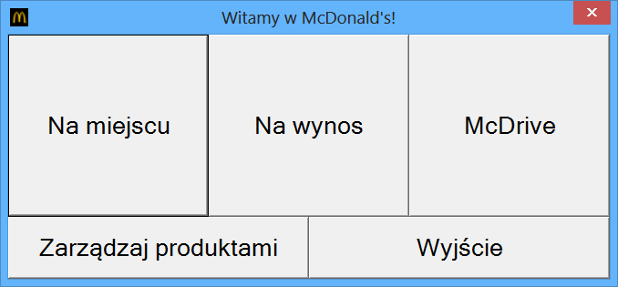
<br>

```cs
private void NewOrder(OrderType type)
{
    var order = new Order { Type = type };
    db.Orders.Add(order);
    db.SaveChanges();
    var form = new OrderForm(this.db, order);
    form.ShowDialog();
}

private void NewEatHereOrderButton_Click(object sender, EventArgs e)
{
    this.NewOrder(OrderType.EatHere);
}

private void NewTakeAwayOrderButton_Click(object sender, EventArgs e)
{
    this.NewOrder(OrderType.TakeAway);
}

private void NewDriveThruOrder_Click(object sender, EventArgs e)
{
    this.NewOrder(OrderType.DriveThru);
}
```

<div style="page-break-after: always;"></div>

Po kliknięciu przycisku *Zarządzaj produktami* wyświetlony zostaje panel umożliwiający dodawanie, edycję i usuwanie kategorii oraz produktów zaimplementowany podczas laboratorium.

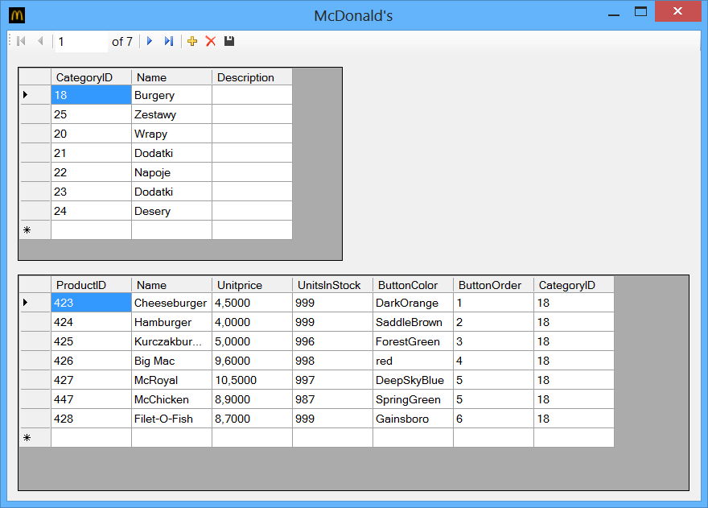

<div style="page-break-after: always;"></div>

Po kliknięciu przycisku *Na miejscu*, *Na wynos* albo *McDrive*, wyświetlone zostaje okno składania zamówienia. Aplikacja wspiera zarówno nazwy kolorów stosowane w językach HTML oraz CSS (np. `Gold`), a także zapis heksadecymalny ze znakiem `#` na początku (np. `#123456`).

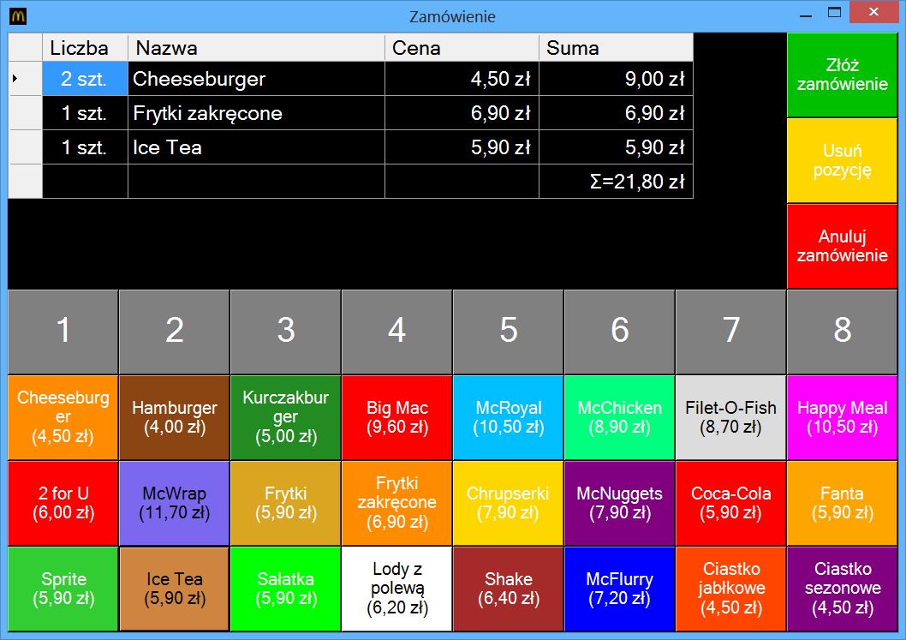

<div style="page-break-after: always;"></div>

Oto fragment kodu źródłowego odpowiedzialny za dynamiczne tworzenie przycisków na podstawie zawartości bazy danych:
```cs
int x = 0, y = 1;
var products = this.db.Products.Include("Category").OrderBy(p => p.ButtonOrder);
foreach (var product in products)
{
    Button button = new Button();
    EventHandler handler = (_, __) =>
    {
        this.AddProduct(product, this.currentNumberOfUnits);
        this.currentNumberOfUnits = 1;
        this.RefreshDetailsList();
    };
    button.Click += handler;
    button.Text = product.Name + "\n(" + Util.FormatPrice(product.Unitprice) + ")";
    button.Font = new Font(button.Font.FontFamily, 12);
    button.BackColor = System.Drawing.ColorTranslator.FromHtml(product.ButtonColor ?? "red");
    button.ForeColor = (button.BackColor.GetBrightness() > 0.5) ? Color.Black : Color.White;
    button.Top = this.DetailsDataGridView.Height + y * this.buttonHeight;
    button.Left = x * this.buttonWidth;
    button.Width = this.buttonWidth;
    button.Height = this.buttonHeight;
    this.Controls.Add(button);

    ++x;
    if (x >= this.numberOfButtonColumns)
    {
        x = 0;
        ++y;
    }
}
```

Kliknięcie przycisku spowoduje dodanie do zamówienia 1 szt. wskazanego produktu. Aby dodać kilka sztuk danego produktu do koszyka, należy:
* najpierw wybrać liczbę sztuk, klikając jeden z przycisków 1-8
* potem wybrać produkt, klikając na odpowiedni przycisk.

<div style="page-break-after: always;"></div>

Aktualna liczba sztuk jest automatycznie zmieniana na 1 szt. po dodaniu produktu do zamówienia. Kolejne dodanie produktu, który został już zamówiony, spowoduje zwiększenie licznika w odpowiednim wierszu listy zamówień (również w tabeli `OrderDetails`).

```cs
private void AddProduct(Product product, int units) {
    if (product.UnitsInStock < units)
    {
        MessageBox.Show(
            "Niewystarczająca liczba sztuk na stanie!",
            "Wystąpił błąd", MessageBoxButtons.OK, MessageBoxIcon.Error
        );
        return;
    }
    product.UnitsInStock -= units;

    try
    {
        var detail = this.db.OrderDetails.Where(
            d => d.OrderID == this.Order.OrderID &&
            d.ProductID == product.ProductID
        ).First();
        detail.NumberOfUnits += units;
    }
    catch (InvalidOperationException)
    {
        var newDetail = new OrderDetail
        {
            OrderID = this.Order.OrderID,
            ProductID = product.ProductID,
            Unitprice = product.Unitprice,
            NumberOfUnits = units
        };
        db.OrderDetails.Add(newDetail);
    }
    finally
    {
        this.db.SaveChanges();
    }
}
```

Próba zamówienia większej liczby produktu niż dostępna (pole `UnitsInStock`) zakończy się niepowodzeniem. Użytkownikowi zostanie wyświetlona informacja o wystąpieniu błędu.

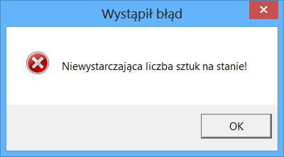

<div style="page-break-after: always;"></div>

Aby usunąć produkt z listy zamawianych pozycji, należy wskazać odpowiedni wiersz albo komórkę, a następnie kliknąć przycisk *Usuń pozycję*. Usunięte produkty trafiają z powrotem do puli dostępnych produktów (pole `UnitsInStock`).

```cs
OrderDetail detail =
        (from d in db.OrderDetails
        where d.OrderID == this.Order.OrderID && d.ProductID == productId
        select d).FirstOrDefault();
if (detail != null)
{
    detail.Product.UnitsInStock += detail.NumberOfUnits;
    this.db.OrderDetails.Remove(detail);
}

this.db.SaveChanges();
this.RefreshDetailsList();
```

Aktualnie składane zamówienie można jeszcze anulować. Aby nie doszło do przypadkowego anulowania zamówienia, należy potwierdzić chęć wykonania tej operacji. Przy anulowaniu zamówienia wszystkie produkty wracają do puli dostępnych produktów.

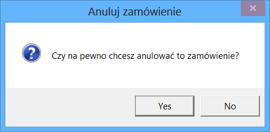
<br>
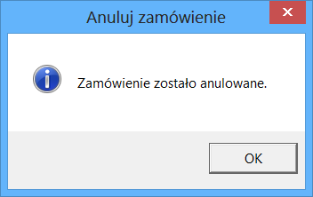
<br>

```cs
this.Order.Status = OrderStatus.Cancelled;
foreach (var detail in this.Order.Details)
{
    detail.Product.UnitsInStock += detail.NumberOfUnits;
}
this.db.SaveChanges();
this.Close();
MessageBox.Show(
    "Zamówienie zostało anulowane.",
    "Anuluj zamówienie", MessageBoxButtons.OK, MessageBoxIcon.Information);    
```

<div style="page-break-after: always;"></div>

Po dodaniu wszystkich produktów do koszyka należy złożyć zamówienie, klikając na zielony przycisk. Wówczas zamówienie zmieni stan na przyjęte do realizacji. Za zamówione burgery i frytki trzeba przecież jeszcze słono zapłacić. Użytkownikowi zostanie wyświetlona informacja zawierająca należną kwotę oraz trzycyfrowy numer zamówienia.

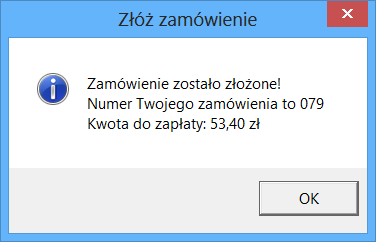
<br>

```cs
this.Order.Status = OrderStatus.Submitted;
this.db.SaveChanges();
this.Close();
MessageBox.Show(
    "Zamówienie zostało złożone!\n" +
    "Numer Twojego zamówienia to " + this.Order.GetOrderNumber() + "\n" + 
    "Kwota do zapłaty: " + Util.FormatPrice(this.TotalPrice),
    "Złóż zamówienie", MessageBoxButtons.OK, MessageBoxIcon.Information);
```
