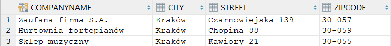

# Hibernate, JPA
## Tomasz Zawadzki

Pierwsza część sprawozdania zawiera rozwiązania wszystkich zadań z instrukcji (punkty II-XII). Każdy punkt zawiera wycinek schematu bazy danych z instrukcji (opcjonalnie), kod źródłowy (całe pliki lub tylko zmodyfikowane fragmenty) oraz zawartość konsoli po wykonaniu programu (opcjonalnie).

Zgodnie z instrukcją wykonane kroki są udokumetowane logami wywołań SQL-owych, diagramem bazy danych z IntelliJ/DataGrip oraz wynikami zapytań `SELECT * FROM`.

Druga część sprawozdania zawiera krótki opis działania przygotowanej aplikacji służącej do składania zamówień. Interfejs aplikacji jest wzorowany na konsolach konfiguracyjnych urządzeń sieciowych.

---

### II. Product

##### hibernate.cfg.xml
```xml
<?xml version='1.0' encoding='utf-8'?>
<!DOCTYPE hibernate-configuration PUBLIC
        "-//Hibernate/Hibernate Configuration DTD//EN"
        "http://www.hibernate.org/dtd/hibernate-configuration-3.0.dtd">
<hibernate-configuration>
    <session-factory>
        <property name="connec-tion.driver_class">org.apache.derby.jdbc.ClientDriver</property>
        <property name="connection.url">jdbc:derby://127.0.0.1/TZawadzkiJPA</property>
        <property name="show_sql">true</property>
        <property name="format_sql">true</property>
        <property name="use_sql_comments">true</property>
        <property name="hbm2ddl.auto">update</property>
        <mapping class="Product"></mapping>
    </session-factory>
</hibernate-configuration>
```

##### Product.java
```java
import javax.persistence.Entity;
import javax.persistence.Id;

@Entity
public class Product {
    @Id
    private String ProductName;
    private int UnitsOnStock;
```

```java
    public Product() {
    }

    public Product(String ProductName, int UnitsOnStock) {
        this.ProductName = ProductName;
        this.UnitsOnStock = UnitsOnStock;
    }
}
```

##### Main.java
```java
import org.hibernate.Session;
import org.hibernate.SessionFactory;
import org.hibernate.Transaction;
import org.hibernate.cfg.Configuration;

import java.util.Scanner;

public class Main {
    private static SessionFactory sessionFactory = null;

    public static void main(String[] args) {
        sessionFactory = getSessionFactory();
        Session session = sessionFactory.openSession();
        Transaction tx = session.beginTransaction();

        Scanner inputScanner = new Scanner(System.in);
        System.out.print("Nazwa produktu: ");
        String productName = inputScanner.nextLine();
        System.out.print("Stan magazynowy: ");
        int unitsOnStock = Integer.parseInt(inputScanner.nextLine());
        Product product = new Product(productName, unitsOnStock);
        session.persist(product);

        tx.commit();
        session.close();
    }

    private static SessionFactory getSessionFactory() {
        if (sessionFactory == null) {
            Configuration configuration = new Configuration();
            sessionFactory = configuration.configure().buildSessionFactory();
        }
        return sessionFactory;
    }
}
```
<div style="page-break-after: always;"></div>

##### SQL
```sql
Hibernate: 
    
    create table Product (
       ProductName varchar(255) not null,
        UnitsOnStock integer not null,
        primary key (ProductName)
    )
```

```sql
Hibernate: 
    /* insert Product
        */ insert 
        into
            Product
            (UnitsOnStock, ProductName) 
        values
            (?, ?)
```

`SELECT * FROM Product;`


<div style="page-break-after: always;"></div>

### III. Supplier &larr; Product


##### hibernate.cfg.xml
```xml
<mapping class="Supplier"></mapping>
```

##### Product.java
```java
@ManyToOne
@JoinColumn(name="SupplierCompanyName")
private Supplier Supplier;

public void setSupplier(Supplier supplier) {
    this.Supplier = supplier;
}
```

##### Supplier.java
```java
import javax.persistence.Entity;
import javax.persistence.Id;

@Entity
public class Supplier {
    @Id
    private String CompanyName;
    private String Street;
    private String City;

    public Supplier() {
    }

    public Supplier(String CompanyName, String Street, String City) {
        this.CompanyName = CompanyName;
        this.Street = Street;
        this.City = City;
    }
}
```

##### Main.java
```java
Supplier supplier = new Supplier("Hurtownia fortepianów", "Chopina 88", "Kraków");
session.persist(supplier);

Product product = session.get(Product.class, "Fortepian");
product.setSupplier(supplier);
session.persist(product);
```

##### SQL
```sql
Hibernate: 
    
    alter table Product 
       add column SupplierCompanyName varchar(255)
Hibernate: 
    
    create table Supplier (
       CompanyName varchar(255) not null,
        City varchar(255),
        Street varchar(255),
        primary key (CompanyName)
    )
Hibernate: 
    
    alter table Product 
       add constraint FK8tyd737am5p4dcvbibadpijld 
       foreign key (SupplierCompanyName) 
       references Supplier
```

```sql
Hibernate: 
    select
        product0_.ProductName as ProductN1_0_0_,
        product0_.SupplierCompanyName as Supplier3_0_0_,
        product0_.UnitsOnStock as UnitsOnS2_0_0_,
        supplier1_.CompanyName as CompanyN1_1_1_,
        supplier1_.City as City2_1_1_,
        supplier1_.Street as Street3_1_1_ 
    from
        Product product0_ 
    left outer join
        Supplier supplier1_ 
            on product0_.SupplierCompanyName=supplier1_.CompanyName 
    where
        product0_.ProductName=?
Hibernate: 
    /* insert Supplier
        */ insert 
        into
            Supplier
            (City, Street, CompanyName) 
        values
            (?, ?, ?)
Hibernate: 
    /* update
        Product */ update
            Product 
        set
            SupplierCompanyName=?,
            UnitsOnStock=? 
        where
            ProductName=?
```

`SELECT * FROM Product;`


`SELECT * FROM Supplier;`


<div style="page-break-after: always;"></div>

### IV. Supplier &rarr; Product


#### Wersja z tabelą łącznikową

##### hibernate.cfg.xml
```xml
<property name="hbm2ddl.auto">create</property>
```

##### Product.java
```java
@Id
private String ProductName;
private int UnitsOnStock;
```

##### Supplier.java
```java
@OneToMany
private Set<Product> Products = new HashSet<>();

public void addProduct(Product product) {
    this.Products.add(product);
}
```

##### Main.java
```java
Product[] products = new Product[] {
        new Product("Fortepian", 123),
        new Product("Gitara", 45),
        new Product("Flet", 67),
        new Product("Trąbka", 89)
};
for (Product product : products) {
    session.persist(product);
}

Supplier supplier = new Supplier("Hurtownia instrumentów", "Czarnowiejska 139", "Kraków");
session.persist(supplier);

for (Product product : products) {
    supplier.addProduct(product);
}
```

<div style="page-break-after: always;"></div>

##### SQL
```sql
Hibernate: 
    
    create table Product (
       ProductName varchar(255) not null,
        UnitsOnStock integer not null,
        primary key (ProductName)
    )
Hibernate: 
    
    create table Supplier (
       CompanyName varchar(255) not null,
        City varchar(255),
        Street varchar(255),
        primary key (CompanyName)
    )
Hibernate: 
    
    create table Supplier_Product (
       Supplier_CompanyName varchar(255) not null,
        Products_ProductName varchar(255) not null,
        primary key (Supplier_CompanyName, Products_ProductName)
    )
Hibernate: 
    
    alter table Supplier_Product 
       add constraint UK_4quw533yhfv4oxdlj2crgegp8 unique (Products_ProductName)
Hibernate: 
    
    alter table Supplier_Product 
       add constraint FK8tydxwngwxbljwfqo3qnamry9 
       foreign key (Products_ProductName) 
       references Product
Hibernate: 
    
    alter table Supplier_Product 
       add constraint FKlmpqedkbbciufpgfdutgyaxhd 
       foreign key (Supplier_CompanyName) 
       references Supplier
```

```sql
Hibernate: 
    /* insert Product
        */ insert 
        into
            Product
            (UnitsOnStock, ProductName) 
        values
            (?, ?)
Hibernate: 
    /* insert Product
        */ insert 
        into
            Product
            (UnitsOnStock, ProductName) 
        values
            (?, ?)
Hibernate: 
    /* insert Product
        */ insert 
        into
            Product
            (UnitsOnStock, ProductName) 
        values
            (?, ?)
Hibernate: 
    /* insert Product
        */ insert 
        into
            Product
            (UnitsOnStock, ProductName) 
        values
            (?, ?)
Hibernate: 
    /* insert Supplier
        */ insert 
        into
            Supplier
            (City, Street, CompanyName) 
        values
            (?, ?, ?)
Hibernate: 
    /* insert collection
        row Supplier.Products */ insert 
        into
            Supplier_Product
            (Supplier_CompanyName, Products_ProductName) 
        values
            (?, ?)
Hibernate: 
    /* insert collection
        row Supplier.Products */ insert 
        into
            Supplier_Product
            (Supplier_CompanyName, Products_ProductName) 
        values
            (?, ?)
Hibernate: 
    /* insert collection
        row Supplier.Products */ insert 
        into
            Supplier_Product
            (Supplier_CompanyName, Products_ProductName) 
        values
            (?, ?)
Hibernate: 
    /* insert collection
        row Supplier.Products */ insert 
        into
            Supplier_Product
            (Supplier_CompanyName, Products_ProductName) 
        values
            (?, ?)
```

`SELECT * FROM Product;`


`SELECT * FROM Supplier;`


`SELECT * FROM Supplier_Product;`


<div style="page-break-after: always;"></div>

#### Wersja bez tabeli łącznikowej

##### Supplier.java
```java
@OneToMany
@JoinColumn(name="SupplierCompanyName")
private Set<Product> Products = new HashSet<>();
```

##### SQL
```sql
Hibernate: 
    
    create table Product (
       ProductName varchar(255) not null,
        UnitsOnStock integer not null,
        SupplierCompanyName varchar(255),
        primary key (ProductName)
    )
Hibernate: 
    
    create table Supplier (
       CompanyName varchar(255) not null,
        City varchar(255),
        Street varchar(255),
        primary key (CompanyName)
    )
Hibernate: 
    
    alter table Product 
       add constraint FK8tyd737am5p4dcvbibadpijld 
       foreign key (SupplierCompanyName) 
       references Supplier
```

```sql
Hibernate: 
    /* insert Product
        */ insert 
        into
            Product
            (UnitsOnStock, ProductName) 
        values
            (?, ?)
Hibernate: 
    /* insert Product
        */ insert 
        into
            Product
            (UnitsOnStock, ProductName) 
        values
            (?, ?)
Hibernate: 
    /* insert Product
        */ insert 
        into
            Product
            (UnitsOnStock, ProductName) 
        values
            (?, ?)
Hibernate: 
    /* insert Product
        */ insert 
        into
            Product
            (UnitsOnStock, ProductName) 
        values
            (?, ?)
Hibernate: 
    /* insert Supplier
        */ insert 
        into
            Supplier
            (City, Street, CompanyName) 
        values
            (?, ?, ?)
Hibernate: 
    /* create one-to-many row Supplier.Products */ update
        Product 
    set
        SupplierCompanyName=? 
    where
        ProductName=?
Hibernate: 
    /* create one-to-many row Supplier.Products */ update
        Product 
    set
        SupplierCompanyName=? 
    where
        ProductName=?
Hibernate: 
    /* create one-to-many row Supplier.Products */ update
        Product 
    set
        SupplierCompanyName=? 
    where
        ProductName=?
Hibernate: 
    /* create one-to-many row Supplier.Products */ update
        Product 
    set
        SupplierCompanyName=? 
    where
        ProductName=?
```

`SELECT * FROM Product;`


`SELECT * FROM Supplier;`


<div style="page-break-after: always;"></div>

### V. Supplier &harr; Product


##### Product.java
```java
@ManyToOne
@JoinColumn(name="SupplierCompanyName")
private Supplier Supplier;

public void setSupplier(Supplier supplier) {
    this.Supplier = supplier;
}

public Supplier getSupplier() {
    return Supplier;
}
```

##### Supplier.java
```java
@OneToMany(mappedBy="Supplier")
private Set<Product> Products = new HashSet<>();

public void addProduct(Product product) {
    product.setSupplier(this);
    this.Products.add(product);
}

public String getCompanyName() {
    return CompanyName;
}
```

##### Main.java
```java
for (Product product : products) {
    supplier.addProduct(product);
    System.out.println(product.getSupplier().getCompanyName());
}
```

<div style="page-break-after: always;"></div>

##### SQL
```sql
Hibernate: 

    create table Product (
       ProductName varchar(255) not null,
        UnitsOnStock integer not null,
        SupplierCompanyName varchar(255),
        primary key (ProductName)
    )
Hibernate: 
    
    create table Supplier (
       CompanyName varchar(255) not null,
        City varchar(255),
        Street varchar(255),
        primary key (CompanyName)
    )
Hibernate: 
    
    alter table Product 
       add constraint FK8tyd737am5p4dcvbibadpijld 
       foreign key (SupplierCompanyName) 
       references Supplier
```

```sql
Hibernate: 
    /* insert Product
        */ insert 
        into
            Product
            (SupplierCompanyName, UnitsOnStock, ProductName) 
        values
            (?, ?, ?)
Hibernate: 
    /* insert Product
        */ insert 
        into
            Product
            (SupplierCompanyName, UnitsOnStock, ProductName) 
        values
            (?, ?, ?)
Hibernate: 
    /* insert Product
        */ insert 
        into
            Product
            (SupplierCompanyName, UnitsOnStock, ProductName) 
        values
            (?, ?, ?)
Hibernate: 
    /* insert Product
        */ insert 
        into
            Product
            (SupplierCompanyName, UnitsOnStock, ProductName) 
        values
            (?, ?, ?)
Hibernate: 
    /* insert Supplier
        */ insert 
        into
            Supplier
            (City, Street, CompanyName) 
        values
            (?, ?, ?)
Hibernate: 
    /* update
        Product */ update
            Product 
        set
            SupplierCompanyName=?,
            UnitsOnStock=? 
        where
            ProductName=?
Hibernate: 
    /* update
        Product */ update
            Product 
        set
            SupplierCompanyName=?,
            UnitsOnStock=? 
        where
            ProductName=?
Hibernate: 
    /* update
        Product */ update
            Product 
        set
            SupplierCompanyName=?,
            UnitsOnStock=? 
        where
            ProductName=?
Hibernate: 
    /* update
        Product */ update
            Product 
        set
            SupplierCompanyName=?,
            UnitsOnStock=? 
        where
            ProductName=?
```

`SELECT * FROM Product;`


`SELECT * FROM Supplier;`


<div style="page-break-after: always;"></div>

### VI. Category

##### hibernate.cfg.xml
```xml
<mapping class="Category"></mapping>
```

##### Category.java
```java
import javax.persistence.*;
import java.util.HashSet;
import java.util.Set;

@Entity
public class Category {
    @Id
    @GeneratedValue
    private int CategoryID;
    private String Name;

    @OneToMany(mappedBy="Category")
    private Set<Product> Products = new HashSet<>();

    public Category() {
    }

    public Category(String Name) {
        this.Name = Name;
    }

    public String getName() {
        return this.Name;
    }

    public void addProduct(Product product) {
        product.setCategory(this);
        this.Products.add(product);
    }

    public void addProducts(Product... products) {
        for (Product product : products) {
            this.addProduct(product);
        }
    }

    public Product[] getProducts() {
        return this.Products.toArray(new Product[0]);
    }
}
```

<div style="page-break-after: always;"></div>

##### Product.java
```java
@ManyToOne
@JoinColumn(name="CategoryID")
private Category Category;

public String getName() {
    return this.ProductName;
}

public void setCategory(Category category) {
    this.Category = category;
}

public Category getCategory() {
    return this.Category;
}
```

##### Main.java
```java
Product piano = new Product("Fortepian", 123);
Product guitar = new Product("Gitara", 45);
Product flute = new Product("Flet", 67);
Product trumpet = new Product("Trąbka", 89);
for (Product product : new Product[] {piano, guitar, flute, trumpet}) {
    session.persist(product);
}

Category string = new Category("Instrumenty strunowe");
Category wind = new Category("Instrumenty dęte");
for (Category category : new Category[] {string, wind}) {
    session.persist(category);
}

wind.addProducts(flute, trumpet);
```
```java
for (Product product : wind.getProducts()) {
    System.out.println(product.getName());
}
System.out.println(trumpet.getCategory().getName());
```
```
Flet
Trąbka
Instrumenty dęte
```

<div style="page-break-after: always;"></div>

##### SQL
```sql
Hibernate: create sequence hibernate_sequence start with 1 increment by 1
Hibernate: 
    
    create table Category (
       CategoryID integer not null,
        Name varchar(255),
        primary key (CategoryID)
    )
Hibernate: 
    
    create table Product (
       ProductName varchar(255) not null,
        UnitsOnStock integer not null,
        CategoryID integer,
        SupplierCompanyName varchar(255),
        primary key (ProductName)
    )
Hibernate: 
    
    create table Supplier (
       CompanyName varchar(255) not null,
        City varchar(255),
        Street varchar(255),
        primary key (CompanyName)
    )
Hibernate: 
    
    alter table Product 
       add constraint FKf9oip6g0rdsqr327ymf173jf9 
       foreign key (CategoryID) 
       references Category
Hibernate: 
    
    alter table Product 
       add constraint FK8tyd737am5p4dcvbibadpijld 
       foreign key (SupplierCompanyName) 
       references Supplier
```

```sql
Hibernate: 
    
values
    next value for hibernate_sequence
Hibernate: 
    
values
    next value for hibernate_sequence
Hibernate: 
    /* insert Product
        */ insert 
        into
            Product
            (CategoryID, SupplierCompanyName, UnitsOnStock, ProductName) 
        values
            (?, ?, ?, ?)
Hibernate: 
    /* insert Product
        */ insert 
        into
            Product
            (CategoryID, SupplierCompanyName, UnitsOnStock, ProductName) 
        values
            (?, ?, ?, ?)
```
```sql
Hibernate: 
    /* insert Product
        */ insert 
        into
            Product
            (CategoryID, SupplierCompanyName, UnitsOnStock, ProductName) 
        values
            (?, ?, ?, ?)
Hibernate: 
    /* insert Product
        */ insert 
        into
            Product
            (CategoryID, SupplierCompanyName, UnitsOnStock, ProductName) 
        values
            (?, ?, ?, ?)
Hibernate: 
    /* insert Category
        */ insert 
        into
            Category
            (Name, CategoryID) 
        values
            (?, ?)
Hibernate: 
    /* insert Category
        */ insert 
        into
            Category
            (Name, CategoryID) 
        values
            (?, ?)
Hibernate: 
    /* insert Supplier
        */ insert 
        into
            Supplier
            (City, Street, CompanyName) 
        values
            (?, ?, ?)
Hibernate: 
    /* update
        Product */ update
            Product 
        set
            CategoryID=?,
            SupplierCompanyName=?,
            UnitsOnStock=? 
        where
            ProductName=?
Hibernate: 
    /* update
        Product */ update
            Product 
        set
            CategoryID=?,
            SupplierCompanyName=?,
            UnitsOnStock=? 
        where
            ProductName=?
Hibernate: 
    /* update
        Product */ update
            Product 
        set
            CategoryID=?,
            SupplierCompanyName=?,
            UnitsOnStock=? 
        where
            ProductName=?
Hibernate: 
    /* update
        Product */ update
            Product 
        set
            CategoryID=?,
            SupplierCompanyName=?,
            UnitsOnStock=? 
        where
            ProductName=?
```

`SELECT * FROM Category;`


`SELECT * FROM Product;`


`SELECT * FROM Supplier;`


<div style="page-break-after: always;"></div>

### VII. Invoice &harr; Product


##### hibernate.cfg.xml
```xml
<mapping class="Invoice"></mapping>
```

##### Invoice.java
```java
import javax.persistence.*;
import java.util.HashSet;
import java.util.Set;

@Entity
public class Invoice {
    @Id
    @GeneratedValue
    private int InvoiceNumber;
    private int Quantity;

    @ManyToMany
    private Set<Product> Products = new HashSet<>();

    public Invoice() {
    }

    public Invoice(int quantity) {
        this.Quantity = quantity;
    }

    public int getInvoiceNumber() {
        return this.InvoiceNumber;
    }

    public void addProduct(Product product) {
        this.Products.add(product);
        product.addInvoice(this);
    }

    public void addProducts(Product... products) {
        for (Product product : products) {
            this.addProduct(product);
        }
    }

    public Product[] getProducts() {
        return this.Products.toArray(new Product[0]);
    }
}
```

##### Product.java
```java
@ManyToMany(mappedBy="Products")
private Set<Invoice> Invoices = new HashSet<>();

public void addInvoice(Invoice invoice) {
    this.Invoices.add(invoice);
    // invoice.addProduct(this);
}

public Invoice[] getInvoices() {
    return this.Invoices.toArray(new Invoice[0]);
}
```

##### Main.java
```java
Product piano = new Product("Fortepian", 123);
Product guitar = new Product("Gitara", 45);
Product flute = new Product("Flet", 67);
Product trumpet = new Product("Trąbka", 89);
for (Product product : new Product[] {piano, guitar, flute, trumpet}) {
    session.persist(product);
}

Invoice first = new Invoice(1);
Invoice second = new Invoice(2);
for (Invoice invoice : new Invoice[] {first, second}) {
    session.persist(invoice);
}

first.addProduct(piano);
first.addProduct(guitar);
second.addProduct(guitar);
```
```java
for (Product product : first.getProducts()) {
    System.out.println(product.getName());
}
for (Invoice invoice : guitar.getInvoices()) {
    System.out.println(invoice.getInvoiceNumber());
}
```
```
Gitara
Fortepian
1
2
```

<div style="page-break-after: always;"></div>

##### SQL
```sql
Hibernate: create sequence hibernate_sequence start with 1 increment by 1
Hibernate: 
    
    create table Category (
       CategoryID integer not null,
        Name varchar(255),
        primary key (CategoryID)
    )
Hibernate: 
    
    create table Invoice (
       InvoiceNumber integer not null,
        Quantity integer not null,
        primary key (InvoiceNumber)
    )
Hibernate: 
    
    create table Invoice_Product (
       Invoices_InvoiceNumber integer not null,
        Products_ProductName varchar(255) not null,
        primary key (Invoices_InvoiceNumber, Products_ProductName)
    )
Hibernate: 
    
    create table Product (
       ProductName varchar(255) not null,
        UnitsOnStock integer not null,
        CategoryID integer,
        SupplierCompanyName varchar(255),
        primary key (ProductName)
    )
Hibernate: 
    
    create table Supplier (
       CompanyName varchar(255) not null,
        City varchar(255),
        Street varchar(255),
        primary key (CompanyName)
    )
Hibernate: 
    
    alter table Invoice_Product 
       add constraint FKpwsbq166bgjnd1v1jgt5erjwi 
       foreign key (Products_ProductName) 
       references Product
Hibernate: 
    
    alter table Invoice_Product 
       add constraint FK88h51tf9ne7gdg782v2aw46ap 
       foreign key (Invoices_InvoiceNumber) 
       references Invoice
```
```sql
Hibernate: 
    
    alter table Product 
       add constraint FKf9oip6g0rdsqr327ymf173jf9 
       foreign key (CategoryID) 
       references Category
Hibernate: 
    
    alter table Product 
       add constraint FK8tyd737am5p4dcvbibadpijld 
       foreign key (SupplierCompanyName) 
       references Supplier
```

```sql
Hibernate: 
    
values
    next value for hibernate_sequence
Hibernate: 
    
values
    next value for hibernate_sequence
Hibernate: 
    /* insert Product
        */ insert 
        into
            Product
            (CategoryID, SupplierCompanyName, UnitsOnStock, ProductName) 
        values
            (?, ?, ?, ?)
Hibernate: 
    /* insert Product
        */ insert 
        into
            Product
            (CategoryID, SupplierCompanyName, UnitsOnStock, ProductName) 
        values
            (?, ?, ?, ?)
Hibernate: 
    /* insert Product
        */ insert 
        into
            Product
            (CategoryID, SupplierCompanyName, UnitsOnStock, ProductName) 
        values
            (?, ?, ?, ?)
Hibernate: 
    /* insert Product
        */ insert 
        into
            Product
            (CategoryID, SupplierCompanyName, UnitsOnStock, ProductName) 
        values
            (?, ?, ?, ?)
Hibernate: 
    /* insert Invoice
        */ insert 
        into
            Invoice
            (Quantity, InvoiceNumber) 
        values
            (?, ?)
Hibernate: 
    /* insert Invoice
        */ insert 
        into
            Invoice
            (Quantity, InvoiceNumber) 
        values
            (?, ?)
Hibernate: 
    /* insert collection
        row Invoice.Products */ insert 
        into
            Invoice_Product
            (Invoices_InvoiceNumber, Products_ProductName) 
        values
            (?, ?)
Hibernate: 
    /* insert collection
        row Invoice.Products */ insert 
        into
            Invoice_Product
            (Invoices_InvoiceNumber, Products_ProductName) 
        values
            (?, ?)
```

`SELECT * FROM Invoice;`


`SELECT * FROM Invoice_Product;`


<div style="page-break-after: always;"></div>

### IX. JPA

##### persistence.xml
```xml
<?xml version="1.0" encoding="UTF-8" ?>
<persistence xmlns="http://java.sun.com/xml/ns/persistence"
             xmlns:xsi="http://www.w3.org/2001/XMLSchema-instance"
             xsi:schemaLocation="http://java.sun.com/xml/ns/persistence
 http://java.sun.com/xml/ns/persistence/persistence_2_0.xsd" version="2.0">
    <persistence-unit name="derby" transaction-type="RESOURCE_LOCAL">
        <properties>
            <property name="hibernate.connection.driver_class" value="org.apache.derby.jdbc.ClientDriver"/>
            <property name="hibernate.connection.url" value="jdbc:derby://127.0.0.1/TZawadzkiJPA"/>
            <property name="hibernate.show_sql" value="true"/>
            <property name="hibernate.format_sql" value="true"/>
            <property name="hibernate.use_sql_comments" value="true"/>
            <property name="hibernate.hbm2ddl.auto" value="create"/>
        </properties>
    </persistence-unit>
</persistence>
```

##### Main.java
```java
import org.hibernate.SessionFactory;

import javax.persistence.EntityManager;
import javax.persistence.EntityManagerFactory;
import javax.persistence.EntityTransaction;
import javax.persistence.Persistence;

public class Main {
    public static void main(String[] args) {
        EntityManagerFactory emf = Persistence.createEntityManagerFactory("derby");
        EntityManager em = emf.createEntityManager();
        EntityTransaction etx = em.getTransaction();
        etx.begin();

        Product piano = new Product("Fortepian", 123);
        Product guitar = new Product("Gitara", 45);
        Product flute = new Product("Flet", 67);
        Product trumpet = new Product("Trąbka", 89);
        for (Product product : new Product[] {piano, guitar, flute, trumpet}) {
            em.persist(product);
        }

        Category string = new Category("Instrumenty strunowe");
        Category wind = new Category("Instrumenty dęte");
        for (Category category : new Category[] {string, wind}) {
            em.persist(category);
        }

        wind.addProducts(flute, trumpet);
```
```java
        Supplier supplier = new Supplier("Hurtownia instrumentów", "Czarnowiejska 139", "Kraków");
        em.persist(supplier);

        for (Product product : new Product[] {piano, guitar, flute, trumpet}) {
            supplier.addProduct(product);
        }

        for (Product product : wind.getProducts()) {
            System.out.println(product.getName());
        }

        System.out.println(trumpet.getCategory().getName());

        etx.commit();
        em.close();
    }
}
```

##### SQL
```sql
Hibernate: create sequence hibernate_sequence start with 1 increment by 1
Hibernate: 
    
    create table Category (
       CategoryID integer not null,
        Name varchar(255),
        primary key (CategoryID)
    )
Hibernate: 
    
    create table Invoice (
       InvoiceNumber integer not null,
        Quantity integer not null,
        primary key (InvoiceNumber)
    )
Hibernate: 
    
    create table Invoice_Product (
       Invoices_InvoiceNumber integer not null,
        Products_ProductName varchar(255) not null,
        primary key (Invoices_InvoiceNumber, Products_ProductName)
    )
Hibernate: 
    
    create table Product (
       ProductName varchar(255) not null,
        UnitsOnStock integer not null,
        CategoryID integer,
        SupplierCompanyName varchar(255),
        primary key (ProductName)
    )
```
```sql
Hibernate: 
    
    create table Supplier (
       CompanyName varchar(255) not null,
        City varchar(255),
        Street varchar(255),
        primary key (CompanyName)
    )
Hibernate: 
    
    alter table Invoice_Product 
       add constraint FKpwsbq166bgjnd1v1jgt5erjwi 
       foreign key (Products_ProductName) 
       references Product
Hibernate: 
    
    alter table Invoice_Product 
       add constraint FK88h51tf9ne7gdg782v2aw46ap 
       foreign key (Invoices_InvoiceNumber) 
       references Invoice
Hibernate: 
    
    alter table Product 
       add constraint FKf9oip6g0rdsqr327ymf173jf9 
       foreign key (CategoryID) 
       references Category
Hibernate: 
    
    alter table Product 
       add constraint FK8tyd737am5p4dcvbibadpijld 
       foreign key (SupplierCompanyName) 
       references Supplier
```


```sql
Hibernate: 
    
values
    next value for hibernate_sequence
Hibernate: 
    
values
    next value for hibernate_sequence
Hibernate: 
    /* insert Product
        */ insert 
        into
            Product
            (CategoryID, SupplierCompanyName, UnitsOnStock, ProductName) 
        values
            (?, ?, ?, ?)
Hibernate: 
    /* insert Product
        */ insert 
        into
            Product
            (CategoryID, SupplierCompanyName, UnitsOnStock, ProductName) 
        values
            (?, ?, ?, ?)
Hibernate: 
    /* insert Product
        */ insert 
        into
            Product
            (CategoryID, SupplierCompanyName, UnitsOnStock, ProductName) 
        values
            (?, ?, ?, ?)
Hibernate: 
    /* insert Product
        */ insert 
        into
            Product
            (CategoryID, SupplierCompanyName, UnitsOnStock, ProductName) 
        values
            (?, ?, ?, ?)
Hibernate: 
    /* insert Category
        */ insert 
        into
            Category
            (Name, CategoryID) 
        values
            (?, ?)
Hibernate: 
    /* insert Category
        */ insert 
        into
            Category
            (Name, CategoryID) 
        values
            (?, ?)
Hibernate: 
    /* insert Supplier
        */ insert 
        into
            Supplier
            (City, Street, CompanyName) 
        values
            (?, ?, ?)
Hibernate: 
    /* update
        Product */ update
            Product 
        set
            CategoryID=?,
            SupplierCompanyName=?,
            UnitsOnStock=? 
        where
            ProductName=?
Hibernate: 
    /* update
        Product */ update
            Product 
        set
            CategoryID=?,
            SupplierCompanyName=?,
            UnitsOnStock=? 
        where
            ProductName=?
Hibernate: 
    /* update
        Product */ update
            Product 
        set
            CategoryID=?,
            SupplierCompanyName=?,
            UnitsOnStock=? 
        where
            ProductName=?
Hibernate: 
    /* update
        Product */ update
            Product 
        set
            CategoryID=?,
            SupplierCompanyName=?,
            UnitsOnStock=? 
        where
            ProductName=?
```

<div style="page-break-after: always;"></div>

### X. Kaskady

##### Product.java
```java
@ManyToMany(mappedBy="Products", cascade={CascadeType.PERSIST})
```

##### Invoice.java
```java
@ManyToMany(cascade = {CascadeType.PERSIST})
```

##### Main.java
Kaskadowe tworzenie produktów wraz z nową fakturą
```java
/*
for (Product product : new Product[] {piano, guitar, flute, trumpet}) {
    em.persist(product);
}
*/
for (Invoice invoice : new Invoice[] {first, second}) {
    em.persist(invoice);
}
```
Kaskadowe tworzenie faktu wraz z nowymi produktami
```java
for (Product product : new Product[] {piano, guitar, flute, trumpet}) {
    em.persist(product);
}
/*
for (Invoice invoice : new Invoice[] {first, second}) {
    em.persist(invoice);
}
*/
```

##### SQL

`SELECT * FROM Invoice_Product;`


<div style="page-break-after: always;"></div>

### XI. Embedded class

#### @Embedded

##### Address.java
```java
import javax.persistence.*;

@Embeddable
public class Address {
    private String Street;
    private String City;
    private String ZipCode;

    public Address() {
    }

    public Address(String Street, String City, String ZipCode) {
        this.Street = Street;
        this.City = City;
        this.ZipCode = ZipCode;
    }
}
```

##### Supplier.java
```java
@Id
private String CompanyName;
@Embedded
private Address Address;

public Supplier(String CompanyName, Address Address) {
    this.CompanyName = CompanyName;
    this.Address = Address;
}
```

##### Main.java
```java
Address address = new Address("Chopina 88", "Kraków", "30-059");
Supplier supplier = new Supplier("Hurtownia fortepianów", address);
em.persist(supplier);
```

##### SQL

```sql
Hibernate: create sequence hibernate_sequence start with 1 increment by 1
Hibernate: 
    
    create table Category (
       CategoryID integer not null,
        Name varchar(255),
        primary key (CategoryID)
    )
```
```sql
Hibernate: 
    
    create table Invoice (
       InvoiceNumber integer not null,
        Quantity integer not null,
        primary key (InvoiceNumber)
    )
Hibernate: 
    
    create table Invoice_Product (
       Invoices_InvoiceNumber integer not null,
        Products_ProductName varchar(255) not null,
        primary key (Invoices_InvoiceNumber, Products_ProductName)
    )
Hibernate: 
    
    create table Product (
       ProductName varchar(255) not null,
        UnitsOnStock integer not null,
        CategoryID integer,
        SupplierCompanyName varchar(255),
        primary key (ProductName)
    )
Hibernate: 
    
    create table Supplier (
       CompanyName varchar(255) not null,
        City varchar(255),
        Street varchar(255),
        ZipCode varchar(255),
        primary key (CompanyName)
    )
Hibernate: 
    
    alter table Invoice_Product 
       add constraint FKpwsbq166bgjnd1v1jgt5erjwi 
       foreign key (Products_ProductName) 
       references Product
Hibernate: 
    
    alter table Invoice_Product 
       add constraint FK88h51tf9ne7gdg782v2aw46ap 
       foreign key (Invoices_InvoiceNumber) 
       references Invoice
Hibernate: 
    
    alter table Product 
       add constraint FKf9oip6g0rdsqr327ymf173jf9 
       foreign key (CategoryID) 
       references Category
```
```sql
Hibernate: 
    
    alter table Product 
       add constraint FK8tyd737am5p4dcvbibadpijld 
       foreign key (SupplierCompanyName) 
       references Supplier
```

```sql
Hibernate: 
    /* insert Supplier
        */ insert 
        into
            Supplier
            (City, Street, ZipCode, CompanyName) 
        values
            (?, ?, ?, ?)
```

`SELECT * FROM Supplier;`


<div style="page-break-after: always;"></div>

#### b) @SecondaryTable

##### Supplier.java
```java
import javax.persistence.*;
import java.util.HashSet;
import java.util.Set;

@Entity
@SecondaryTable(name="Address")
public class Supplier {
    @Id
    private String CompanyName;

    @Column(table = "Address")
    private String Street;
    @Column(table = "Address")
    private String City;
    @Column(table = "Address")
    private String ZipCode;

    @OneToMany(mappedBy="Supplier")
    private Set<Product> Products = new HashSet<>();

    public Supplier() {
    }

    public Supplier(String CompanyName, String Street, String City, String ZipCode) {
        this.CompanyName = CompanyName;
        this.Street = Street;
        this.City = City;
        this.ZipCode = ZipCode;
    }
}
```

##### Main.java
```java
Supplier supplier = new Supplier("Hurtownia fortepianów", "Chopina 88", "Kraków", "30-059");
em.persist(supplier);
```

##### SQL

```sql
Hibernate: create sequence hibernate_sequence start with 1 increment by 1
Hibernate: 
    
    create table Address (
       City varchar(255),
        Street varchar(255),
        ZipCode varchar(255),
        CompanyName varchar(255) not null,
        primary key (CompanyName)
    )
```
```sql
Hibernate: 
    
    create table Category (
       CategoryID integer not null,
        Name varchar(255),
        primary key (CategoryID)
    )
Hibernate: 
    
    create table Invoice (
       InvoiceNumber integer not null,
        Quantity integer not null,
        primary key (InvoiceNumber)
    )
Hibernate: 
    
    create table Invoice_Product (
       Invoices_InvoiceNumber integer not null,
        Products_ProductName varchar(255) not null,
        primary key (Invoices_InvoiceNumber, Products_ProductName)
    )
Hibernate: 
    
    create table Product (
       ProductName varchar(255) not null,
        UnitsOnStock integer not null,
        CategoryID integer,
        SupplierCompanyName varchar(255),
        primary key (ProductName)
    )
Hibernate: 
    
    create table Supplier (
       CompanyName varchar(255) not null,
        primary key (CompanyName)
    )
Hibernate: 
    
    alter table Address 
       add constraint FKmsck66ewa3voam1ec2mebnieg 
       foreign key (CompanyName) 
       references Supplier
Hibernate: 
    
    alter table Invoice_Product 
       add constraint FKpwsbq166bgjnd1v1jgt5erjwi 
       foreign key (Products_ProductName) 
       references Product
Hibernate: 
    
    alter table Invoice_Product 
       add constraint FK88h51tf9ne7gdg782v2aw46ap 
       foreign key (Invoices_InvoiceNumber) 
       references Invoice
```
```sql
Hibernate: 
    
    alter table Product 
       add constraint FKf9oip6g0rdsqr327ymf173jf9 
       foreign key (CategoryID) 
       references Category
Hibernate: 
    
    alter table Product 
       add constraint FK8tyd737am5p4dcvbibadpijld 
       foreign key (SupplierCompanyName) 
       references Supplier
```


```sql
Hibernate: 
    /* insert Supplier
        */ insert 
        into
            Supplier
            (CompanyName) 
        values
            (?)
Hibernate: 
    /* insert Supplier
        */ insert 
        into
            Address
            (City, Street, ZipCode, CompanyName) 
        values
            (?, ?, ?, ?)
```

`SELECT * FROM Supplier;`


`SELECT * FROM Address;`


<div style="page-break-after: always;"></div>

### XII. Dziedziczenie


##### Company.java
```java
import javax.persistence.*;

@Entity
public class Company {
    @Id
    private String CompanyName;

    @Embedded
    private Address Address;

    public Company() {
    }

    public Company(String CompanyName, Address Address) {
        this.CompanyName = CompanyName;
        this.Address = Address;
    }

    public String getCompanyName() {
        return CompanyName;
    }
}
```

##### Supplier.java
```java
import javax.persistence.Entity;
import javax.persistence.OneToMany;
import java.util.HashSet;
import java.util.Set;
```
```java
@Entity
public class Supplier extends Company {
    private String bankAccountNumber;

    @OneToMany(mappedBy="Supplier")
    private Set<Product> Products = new HashSet<>();

    public Supplier() {
    }

    public Supplier(String companyName, Address address, String bankAccountNumber) {
        super(companyName, address);
        this.bankAccountNumber = bankAccountNumber;
    }

    public void addProduct(Product product) {
        product.setSupplier(this);
        this.Products.add(product);
    }
}
```

##### Customer.java
```java
import javax.persistence.Entity;

@Entity
public class Customer extends Company {
    private int discount;

    public Customer() {
    }

    public Customer(String companyName, Address address, int discount) {
        super(companyName, address);
        this.discount = discount;
    }
}
```

##### Main.java
```java
Address czarnowiejska = new Address("Czarnowiejska 139", "Kraków", "30-057");
Company company = new Company("Zaufana firma S.A.", czarnowiejska);
em.persist(company);

Address chopina = new Address("Chopina 88", "Kraków", "30-059");
Supplier supplier = new Supplier("Hurtownia fortepianów", chopina,
                                    "12 1234 5678 9012 3456 7890");
em.persist(supplier);

Address kawiory = new Address("Kawiory 21", "Kraków", "30-055");
Customer customer = new Customer("Sklep muzyczny", kawiory, 15);
em.persist(customer);
```

<div style="page-break-after: always;"></div>

#### a) SINGLE_TABLE
```java
@Inheritance(strategy=InheritanceType.SINGLE_TABLE)
```

##### SQL
```sql
Hibernate: create sequence hibernate_sequence start with 1 increment by 1
Hibernate: 
    
    create table Category (
       CategoryID integer not null,
        Name varchar(255),
        primary key (CategoryID)
    )
Hibernate: 
    
    create table Company (
       DTYPE varchar(31) not null,
        CompanyName varchar(255) not null,
        City varchar(255),
        Street varchar(255),
        ZipCode varchar(255),
        discount integer,
        bankAccountNumber varchar(255),
        primary key (CompanyName)
    )
Hibernate: 
    
    create table Invoice (
       InvoiceNumber integer not null,
        Quantity integer not null,
        primary key (InvoiceNumber)
    )
Hibernate: 
    
    create table Invoice_Product (
       Invoices_InvoiceNumber integer not null,
        Products_ProductName varchar(255) not null,
        primary key (Invoices_InvoiceNumber, Products_ProductName)
    )
Hibernate: 
    
    create table Product (
       ProductName varchar(255) not null,
        UnitsOnStock integer not null,
        CategoryID integer,
        SupplierCompanyName varchar(255),
        primary key (ProductName)
    )
```
```sql
Hibernate: 
    
    alter table Invoice_Product 
       add constraint FKpwsbq166bgjnd1v1jgt5erjwi 
       foreign key (Products_ProductName) 
       references Product
Hibernate: 
    
    alter table Invoice_Product 
       add constraint FK88h51tf9ne7gdg782v2aw46ap 
       foreign key (Invoices_InvoiceNumber) 
       references Invoice
Hibernate: 
    
    alter table Product 
       add constraint FKf9oip6g0rdsqr327ymf173jf9 
       foreign key (CategoryID) 
       references Category
Hibernate: 
    
    alter table Product 
       add constraint FKo6oiex67n05mb5fwccmxok3mt 
       foreign key (SupplierCompanyName) 
       references Company
```


```sql
Hibernate: 
    /* insert Company
        */ insert 
        into
            Company
            (City, Street, ZipCode, DTYPE, CompanyName) 
        values
            (?, ?, ?, 'Company', ?)
Hibernate: 
    /* insert Supplier
        */ insert 
        into
            Company
            (City, Street, ZipCode, bankAccountNumber, DTYPE, CompanyName) 
        values
            (?, ?, ?, ?, 'Supplier', ?)
Hibernate: 
    /* insert Customer
        */ insert 
        into
            Company
            (City, Street, ZipCode, discount, DTYPE, CompanyName) 
        values
            (?, ?, ?, ?, 'Customer', ?)
```

`SELECT * FROM Company;`


---

#### b) JOINED
```java
@Inheritance(strategy=InheritanceType.JOINED)
```

##### SQL
```sql
Hibernate: create sequence hibernate_sequence start with 1 increment by 1
Hibernate: 
    
    create table Category (
       CategoryID integer not null,
        Name varchar(255),
        primary key (CategoryID)
    )
```
```sql
Hibernate: 
    
    create table Company (
       CompanyName varchar(255) not null,
        City varchar(255),
        Street varchar(255),
        ZipCode varchar(255),
        primary key (CompanyName)
    )
Hibernate: 
    
    create table Customer (
       discount integer not null,
        CompanyName varchar(255) not null,
        primary key (CompanyName)
    )
Hibernate: 
    
    create table Invoice (
       InvoiceNumber integer not null,
        Quantity integer not null,
        primary key (InvoiceNumber)
    )
Hibernate: 
    
    create table Invoice_Product (
       Invoices_InvoiceNumber integer not null,
        Products_ProductName varchar(255) not null,
        primary key (Invoices_InvoiceNumber, Products_ProductName)
    )
Hibernate: 
    
    create table Product (
       ProductName varchar(255) not null,
        UnitsOnStock integer not null,
        CategoryID integer,
        SupplierCompanyName varchar(255),
        primary key (ProductName)
    )
Hibernate: 
    
    create table Supplier (
       bankAccountNumber varchar(255),
        CompanyName varchar(255) not null,
        primary key (CompanyName)
    )
Hibernate: 
    
    alter table Customer 
       add constraint FKfd0u4pi9jsp8nf20u7w1kjobk 
       foreign key (CompanyName) 
       references Company
Hibernate: 
    
    alter table Invoice_Product 
       add constraint FKpwsbq166bgjnd1v1jgt5erjwi 
       foreign key (Products_ProductName) 
       references Product
Hibernate: 
    
    alter table Invoice_Product 
       add constraint FK88h51tf9ne7gdg782v2aw46ap 
       foreign key (Invoices_InvoiceNumber) 
       references Invoice
Hibernate: 
    
    alter table Product 
       add constraint FKf9oip6g0rdsqr327ymf173jf9 
       foreign key (CategoryID) 
       references Category
Hibernate: 
    
    alter table Product 
       add constraint FK8tyd737am5p4dcvbibadpijld 
       foreign key (SupplierCompanyName) 
       references Supplier
Hibernate: 
    
    alter table Supplier 
       add constraint FKm8kdfddnotx7okhnxndhkudvf 
       foreign key (CompanyName) 
       references Company
```

```sql
Hibernate: 
    /* insert Company
        */ insert 
        into
            Company
            (City, Street, ZipCode, CompanyName) 
        values
            (?, ?, ?, ?)
Hibernate: 
    /* insert Supplier
        */ insert 
        into
            Company
            (City, Street, ZipCode, CompanyName) 
        values
            (?, ?, ?, ?)
Hibernate: 
    /* insert Supplier
        */ insert 
        into
            Supplier
            (bankAccountNumber, CompanyName) 
        values
            (?, ?)
Hibernate: 
    /* insert Customer
        */ insert 
        into
            Company
            (City, Street, ZipCode, CompanyName) 
        values
            (?, ?, ?, ?)
Hibernate: 
    /* insert Customer
        */ insert 
        into
            Customer
            (discount, CompanyName) 
        values
            (?, ?)
```

`SELECT * FROM Company;`


`SELECT * FROM Supplier;`


`SELECT * FROM Customer;`


<div style="page-break-after: always;"></div>

#### c) TABLE_PER_CLASS
```java
@Inheritance(strategy=InheritanceType.TABLE_PER_CLASS)
```

##### SQL
```sql
Hibernate: create sequence hibernate_sequence start with 1 increment by 1
Hibernate: 
    
    create table Category (
       CategoryID integer not null,
        Name varchar(255),
        primary key (CategoryID)
    )
Hibernate: 
    
    create table Company (
       CompanyName varchar(255) not null,
        City varchar(255),
        Street varchar(255),
        ZipCode varchar(255),
        primary key (CompanyName)
    )
Hibernate: 
    
    create table Customer (
       CompanyName varchar(255) not null,
        City varchar(255),
        Street varchar(255),
        ZipCode varchar(255),
        discount integer not null,
        primary key (CompanyName)
    )
Hibernate: 
    
    create table Invoice (
       InvoiceNumber integer not null,
        Quantity integer not null,
        primary key (InvoiceNumber)
    )
Hibernate: 
    
    create table Invoice_Product (
       Invoices_InvoiceNumber integer not null,
        Products_ProductName varchar(255) not null,
        primary key (Invoices_InvoiceNumber, Products_ProductName)
    )
```
```sql
Hibernate: 
    
    create table Product (
       ProductName varchar(255) not null,
        UnitsOnStock integer not null,
        CategoryID integer,
        SupplierCompanyName varchar(255),
        primary key (ProductName)
    )
Hibernate: 
    
    create table Supplier (
       CompanyName varchar(255) not null,
        City varchar(255),
        Street varchar(255),
        ZipCode varchar(255),
        bankAccountNumber varchar(255),
        primary key (CompanyName)
    )
Hibernate: 
    
    alter table Invoice_Product 
       add constraint FKpwsbq166bgjnd1v1jgt5erjwi 
       foreign key (Products_ProductName) 
       references Product
Hibernate: 
    
    alter table Invoice_Product 
       add constraint FK88h51tf9ne7gdg782v2aw46ap 
       foreign key (Invoices_InvoiceNumber) 
       references Invoice
Hibernate: 
    
    alter table Product 
       add constraint FKf9oip6g0rdsqr327ymf173jf9 
       foreign key (CategoryID) 
       references Category
Hibernate: 
    
    alter table Product 
       add constraint FK8tyd737am5p4dcvbibadpijld 
       foreign key (SupplierCompanyName) 
       references Supplier
```

```sql
Hibernate: 
    /* insert Company
        */ insert 
        into
            Company
            (City, Street, ZipCode, CompanyName) 
        values
            (?, ?, ?, ?)
Hibernate: 
    /* insert Supplier
        */ insert 
        into
            Supplier
            (City, Street, ZipCode, bankAccountNumber, CompanyName) 
        values
            (?, ?, ?, ?, ?)
Hibernate: 
    /* insert Customer
        */ insert 
        into
            Customer
            (City, Street, ZipCode, discount, CompanyName) 
        values
            (?, ?, ?, ?, ?)
```

`SELECT * FROM Company`


`SELECT * FROM Supplier;`


`SELECT * FROM Customer;`


<div style="page-break-after: always;"></div>

## Zadanie domowe &ndash; aplikacja

##### Order.java
```java
import javax.persistence.*;
import java.util.Date;
import java.util.HashSet;
import java.util.Objects;
import java.util.Set;

@Entity
@Table(name="Order_table")
public class Order {
    @Id
    @GeneratedValue
    private int id;

    @ManyToOne(cascade={CascadeType.PERSIST})
    @JoinColumn(name="CustomerID")
    private Customer customer;

    private boolean submitted = false;

    private Date submittedOn;

    @OneToMany(mappedBy="order", cascade={CascadeType.PERSIST})
    private Set<OrderDetail> details = new HashSet<>();

    public Order() {
    }

    public Order(Customer customer) {
        this.customer = customer;
    }

    public void addDetail(OrderDetail detail) {
        this.details.add(detail);
        detail.setOrder(this);
    }

    public OrderDetail[] getDetails() {
        return this.details.toArray(new OrderDetail[0]);
    }

    public void removeDetail(OrderDetail detail) {
        this.details.remove(detail);
    }

    public int getId() {
        return this.id;
    }
```
```java
    public void submit() {
        this.submitted = true;
        this.submittedOn = new Date();
    }

    public boolean isEmpty() {
        for (OrderDetail detail : this.getDetails()) {
            if (detail.getQuantity() > 0) {
                return false;
            }
        }
        return true;
    }

    public Customer getCustomer() {
        return this.customer;
    }

    @Override
    public boolean equals(Object o) {
        if (this == o) return true;
        if (o == null || getClass() != o.getClass()) return false;
        Order order = (Order) o;
        return id == order.id;
    }

    @Override
    public int hashCode() {
        return Objects.hash(id);
    }
}
```

##### OrderDetail.java
```java
import javax.persistence.*;
import java.io.Serializable;
import java.util.Objects;

@Entity
@Table(name="Order_Detail")
public class OrderDetail implements Serializable {
    @Id
    @ManyToOne
    @JoinColumn(name="OrderID")
    private Order order;

    @Id
    @ManyToOne
    @JoinColumn(name="ProductID")
    private Product product;

    private int quantity;
```
```java
    public OrderDetail() {
    }

    public OrderDetail(Product product, int quantity) {
        this.product = product;
        this.quantity = quantity;
    }

    public OrderDetail(Product product) {
        this(product, 1);
    }

    public void setOrder(Order order) {
        this.order = order;
    }

    @Override
    public boolean equals(Object o) {
        if (this == o) return true;
        if (o == null || getClass() != o.getClass()) return false;
        OrderDetail that = (OrderDetail) o;
        return Objects.equals(order, that.order) &&
                Objects.equals(product, that.product);
    }

    @Override
    public int hashCode() {
        return Objects.hash(order, product);
    }

    public Product getProduct() {
        return this.product;
    }

    public int getQuantity() {
        return this.quantity;
    }

    public void updateQuantity(int delta) {
        this.quantity += delta;
    }
}
```

##### Main.java
```java
import javax.persistence.*;
import java.io.File;
import java.io.FileNotFoundException;
import java.util.List;
import java.util.Random;
import java.util.Scanner;
```
```java
public class Main {
    private static final EntityManagerFactory emf = Persistence.createEntityManagerFactory("derby");
    private static final EntityManager em = emf.createEntityManager();
    private static final Scanner inputScanner = new Scanner(System.in);
    private static final Random random = new Random();

    public static void main(String[] args) throws FileNotFoundException {
        insertInstrumentsFromFile("instrumenty.txt");

        Customer customer = createNewCustomer("TomSoft", "Kawiory 21", "Kraków", "30-055", 15);

        while (true) {
            System.out.print(">");
            String command = inputScanner.nextLine();
            switch (command) {
                case "?":
                    for (String c : new String[]{"order", "exit", "end"}) {
                        System.out.println("\t" + c);
                    }
                    break;

                case "order":
                    Order order = createNewOrder(customer);
                    placeOrder(order);
                    break;

                case "exit":
                case "end":
                    return;

                default:
                    System.out.println("Invalid command");
            }
        }
    }

    private static void placeOrder(Order order) {
        while (true) {
            System.out.print(String.format("(Order-%d)>", order.getId()));
            String command = inputScanner.nextLine();
            switch (command) {
                case "?":
                    for (String c : new String[]{"<product name>", "submit", "cancel"}) {
                        System.out.println("\t" + c);
                    }
                    break;

                case "show":
                    showOrder(order);
                    break;

                case "submit":
                    if (order.isEmpty()) {
                        System.out.println("Your order is empty");
                    } else {
                        order.submit();
                        em.persist(order);
                        System.out.println("Your order has been submitted. Thank you!");
                        return;
                    }
                    break;

                case "cancel":
                    System.out.println("Your order has been cancelled.");
                    return;

                default:
                    TypedQuery<Product> query = em.createQuery("from Product as product"
                        + " where lower(product.ProductName) LIKE '%'||lower(:ProductName)||'%'",
                        Product.class);
                    query.setParameter("ProductName", command);
                    List<Product> results = query.getResultList();
                    switch (results.size()) {
                        case 0:
                            System.out.println("Product not found");
                            break;

                        case 1:
                            Product product = results.get(0);
                            while (!modifyProduct(order, product));
                            break;

                        default:
                            System.out.println("Ambiguous product name");
                            for (Product p : results) {
                                System.out.println("\t" + p.getName());
                            }
                    }
            }
        }
    }

    private static boolean modifyProduct(Order order, Product product) {
        System.out.print(String.format("(Order-%d)(Product-%s)>",
            order.getId(), product.getName()));
        String command = inputScanner.nextLine();
        switch (command) {
            case "?":
                for (String c : new String[]{"<quantity delta>", "exit", "end"}) {
                    System.out.println("\t" + c);
                }
                return false;

            case "end":
            case "exit":
                return true;
        }
        int delta;
        try {
            delta = Integer.parseInt(command);
        } catch (NumberFormatException __) {
            System.out.println("Invalid number");
            return false;
        }

        if (delta == 0) {
            System.out.println("Nothing changed");
            return true;
        }

        for (OrderDetail detail : order.getDetails()) {
            if (detail.getProduct() == product) {
                int after = detail.getQuantity() + delta;
                if (after < 0) {
                    System.out.println("Quantity must be a non-negative integer");
                    return false;
                }

                EntityTransaction etx = em.getTransaction();
                etx.begin();
                detail.updateQuantity(delta);
                em.persist(detail);
                etx.commit();
                if (after == 0) {
                    System.out.println(String.format("Removed all %s from your order",
                        product.getName()));
                } else if (delta > 0) {
                    System.out.println(String.format("Added %d of %s from your order",
                        delta, product.getName()));
                } else {
                    System.out.println(String.format("Removed %d of %s from your order",
                        -delta, product.getName()));
                }
                return true;
            }
        }

        if (delta < 0) {
            System.out.println("Quantity must be a non-negative integer");
            return false;
        }

        EntityTransaction etx = em.getTransaction();
        etx.begin();
        OrderDetail detail = new OrderDetail(product, delta);
        order.addDetail(detail);
        em.persist(detail);
        etx.commit();
        System.out.println(String.format("Added %d of %s to your order",
            delta, product.getName()));
        return true;
    }

    private static void showOrder(Order order) {
        if (order.isEmpty()) {
            System.out.println("Your order is empty");
            return;
        }

        double total = 0;
        for (OrderDetail detail : order.getDetails()) {
            if (detail.getQuantity() == 0) {
                continue;
            }
            Product product = detail.getProduct();
            int quantity = detail.getQuantity();
            System.out.println(quantity + "x " + product.getName());
            total += product.getUnitPrice() * quantity;
        }
        System.out.println(String.format("Total price: $%.2f", total));
        int discountPercent = order.getCustomer().getDiscount();
        if (discountPercent != 0) {
            System.out.println(String.format("Discount: %d%%", discountPercent));
            System.out.println(String.format("After discount: $%.2f",
                total * (1 - discountPercent * 0.01)));
        }
    }

    private static Order createNewOrder(Customer customer) {
        EntityTransaction etx = em.getTransaction();
        etx.begin();
        Order order = new Order(customer);
        em.persist(order);
        etx.commit();
        return order;
    }

    private static Customer createNewCustomer(
        String companyName, String street, String city, String zipCode, int discount
    ) {
        EntityTransaction etx = em.getTransaction();
        etx.begin();
        Address address = new Address(street, city, zipCode);
        Customer customer = new Customer(companyName, address, 15);
        em.persist(customer);
        etx.commit();
        return customer;
    }

    private static void insertInstrumentsFromFile(String path) throws FileNotFoundException {
        EntityTransaction etx = em.getTransaction();
        etx.begin();

        File file = new File(path);
        Scanner scanner = new Scanner(file);
        while (scanner.hasNextLine()) {
            String productName = scanner.nextLine();
            int unitsInStock = random.nextInt(1000);
            double unitPrice = random.nextInt(1000)*10 + 9.99d;
            Product product = new Product(productName, unitsInStock, unitPrice);
            em.persist(product);
        }
        scanner.close();

        etx.commit();
    }
}
```

#### Schemat bazy danych


**Ciekawostka:** Hibernate nie potrafi prawidłowo dokonać mapowania klasy `Order` do tabeli `Order`:
```sql
create table Order (
       id integer not null,
        test varchar(255),
        primary key (id)
    )
```
```
ERROR: Błąd składniowy: Encountered "Order" at line 1, column 32.
```
Najprawdopodobniej dzieje się tak dlatego, że nazwa tabeli jest umieszczana bezpośrednio w zapytaniu, a słowo `Order` jest słowem kluczowym języka SQL. Rozwiązaniem problemu jest użycie adnotacji `@Table(name="Order_table")`.

#### Przykład uruchomienia

```sql
>?
	order
	exit
	end
```
```sql
>order
(Order-1)>?
	<product name>
	submit
	cancel
(Order-1)>submit
Your order is empty
(Order-1)>pian
Ambiguous product name
	Fortepian
	Pianino
(Order-1)>forte
(Order-1)(Product-Fortepian)>1
Added 1 of Fortepian to your order
(Order-1)>pian
Ambiguous product name
	Fortepian
	Pianino
(Order-1)>pianino
(Order-1)(Product-Pianino)>2
Added 2 of Pianino to your order
(Order-1)>fortep
(Order-1)(Product-Fortepian)>-1
Removed all Fortepian from your order
(Order-1)>piani
(Order-1)(Product-Pianino)>-2
Removed all Pianino from your order
(Order-1)>show
Your order is empty
(Order-1)>fortep
(Order-1)(Product-Fortepian)>3
Added 3 of Fortepian from your order
(Order-1)>pianin
(Order-1)(Product-Pianino)>-42
Quantity must be a non-negative integer
(Order-1)(Product-Pianino)>fortep
Invalid number
(Order-1)(Product-Pianino)>2
Added 2 of Pianino from your order
(Order-1)>flet
Ambiguous product name
	Flet podłużny
	Flet poprzeczny
(Order-1)>poprz
(Order-1)(Product-Flet poprzeczny)>2
Added 2 of Flet poprzeczny to your order
(Order-1)>submit
Your order has been submitted. Thank you!
>?
	order
	exit
	end
>order
(Order-2)>
```

<div style="page-break-after: always;"></div>

#### Tworzenie nowego zamówienia
```sql
>order
(Order-1)>?
	<product name>
	submit
	cancel
```

#### Wybieranie przedmiotu
```sql
(Order-1)>flet
Ambiguous product name
	Flet podłużny
	Flet poprzeczny
(Order-1)>flet poprz
(Order-1)(Product-Flet poprzeczny)>
```

#### Dodawanie produktu do zamówienia
```sql
(Order-1)(Product-Flet poprzeczny)>3
Added 3 of Flet poprzeczny to your order
```

#### Modyfikacja liczby sztuk

```sql
(Order-1)(Product-Flet poprzeczny)>-2
Removed 2 of Flet poprzeczny from your order
```

#### Usuwanie pozycji z zamówienia

```sql
(Order-1)(Product-Flet poprzeczny)>-1
Removed 1 of Flet poprzeczny from your order
```

```sql
(Order-1)(Product-Flet poprzeczny)>-42
Quantity must be a non-negative integer
(Order-1)(Product-Flet poprzeczny)>exit
```

<div style="page-break-after: always;"></div>

#### Wyświetlanie zamówienia
```sql
(Order-1)>show
3x Altówka
4x Kontrabas
1x Skrzypce
2x Wiolonczela
Total price: $69019,90
Discount: 15%
After discount: $58666,91
```

```sql
(Order-2)>show
Your order is empty
```

#### Składanie zamówienia
```sql
(Order-1)>submit
Your order has been submitted. Thank you!
```

```sql
(Order-2)>submit
Your order is empty
```

#### Anulowanie zamówienia
```sql
(Order-3)>cancel
Your order has been cancelled.
```

#### Wyjście
```sql
>exit
```
