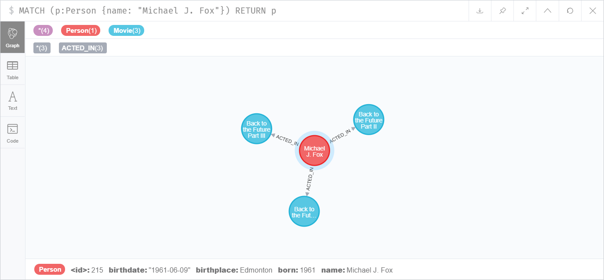
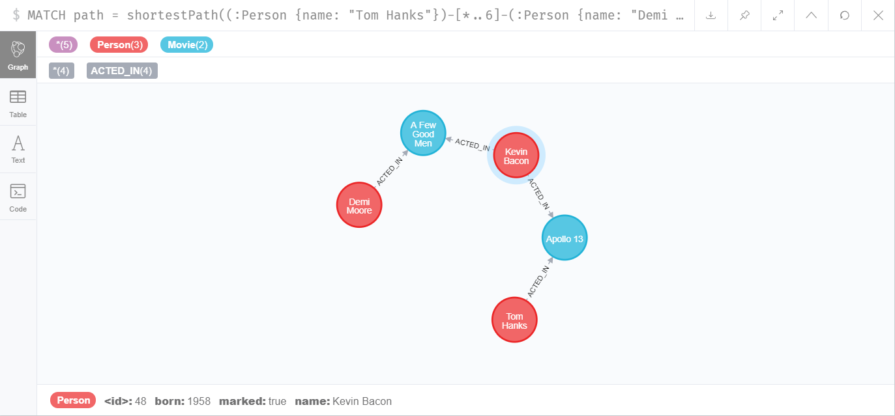
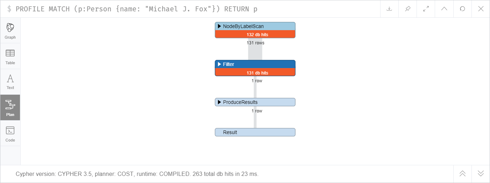

# Neo4j
## Tomasz Zawadzki

##### 1. Zainstalować serwer neo4j lokalnie (https://neo4j.com/download-center/#releases).
Zainstalowałem Neo4j 3.5.12, Neo4j Browser 4.0.1.

##### 2. Wgrać bazę:
```sql
LOAD CSV WITH HEADERS
FROM 'https://neo4j.com/docs/cypher-manual/3.5/csv/query-tuning/movies.csv' AS line
MERGE (m:Movie { title: line.title })
ON CREATE SET m.released = toInteger(line.released), m.tagline = line.tagline
```
```sql
LOAD CSV WITH HEADERS
FROM 'https://neo4j.com/docs/cypher-manual/3.5/csv/query-tuning/actors.csv' AS line
MATCH (m:Movie { title: line.title })
MERGE (p:Person { name: line.name })
ON CREATE SET p.born = toInteger(line.born)
MERGE (p)-[:ACTED_IN { roles:split(line.roles, ';')}]->(m)
```
```sql
LOAD CSV WITH HEADERS
FROM 'https://neo4j.com/docs/cypher-manual/3.5/csv/query-tuning/directors.csv' AS line
MATCH (m:Movie { title: line.title })
MERGE (p:Person { name: line.name })
ON CREATE SET p.born = toInteger(line.born)
MERGE (p)-[:DIRECTED]->(m)
```

<div style="page-break-after: always;"></div>

##### 3. Zaimplementować funkcję (wystarczy wykonać jedno zapytanie typu MATCH WHERE i wyświetlić wynik). Np. można korzystać z JDBC: https://neo4j.com/blog/neo4j-jdbc-driver-3-0-3-and-3-1-0-released, https://neo4j.com/developer/java/#_neo4j_for_java_developers

Wykorzystałem Neo4j Python Driver (https://neo4j.com/developer/python/).

Zaimplementowałem dwie funkcje:
1. zwracającą tytuły filmów w kolejności chronologicznej (bezargumentową),
2. zwracającą imiona i nazwiska aktorów, którzy wystąpili w filmie o podanym tytule (argument jest przekazywany do zapytania w sposób bezpieczny, czyli uniemożliwiający dokonanie ataku Query Injection).

**requirements.txt**
```txt
neo4j==1.7.2
neobolt==1.7.9
neotime==1.7.4
```

**install.bat**
```bat
pip install -r requirements.txt
```

**main<i></i>.py**
```py
from neo4j import GraphDatabase

uri = 'bolt://localhost:7687'
user = 'neo4j'
password = 'lab5'
driver = GraphDatabase.driver(uri, auth=(user, password))

def list_movies(tx):
    result = tx.run("MATCH (m:Movie) "
                    "RETURN m.title AS title, m.released AS year "
                    "ORDER BY m.released")
    for record in result:
        title, year = record['title'], record['year']
        print(f'{title} ({year})')

def list_movie_actors(tx, movie_title):
    result = tx.run("MATCH (p:Person)-[:ACTED_IN]->(m:Movie) "
                    "WHERE m.title = $title "
                    "RETURN p.name AS name", title=movie_title)
    for record in result:
        print(record['name'])

if __name__ == '__main__':
    with driver.session() as session:
        session.read_transaction(list_movies)
        print()
        session.read_transaction(list_movie_actors, movie_title='The Matrix')
```

Wynik wykonania powyższego programu:
```
Something's Gotta Give (1975)
One Flew Over the Cuckoo's Nest (1975)
Top Gun (1986)
Joe Versus the Volcano (1990)
A Few Good Men (1992)
Hoffa (1992)
A League of Their Own (1992)
Unforgiven (1992)
Sleepless in Seattle (1993)
Johnny Mnemonic (1995)
Apollo 13 (1995)
Stand By Me (1995)
That Thing You Do (1996)
Twister (1996)
The Birdcage (1996)
The Devil's Advocate (1997)
As Good as It Gets (1997)
What Dreams May Come (1998)
When Harry Met Sally (1998)
You've Got Mail (1998)
The Matrix (1999)
The Green Mile (1999)
Snow Falling on Cedars (1999)
Bicentennial Man (1999)
The Replacements (2000)
Jerry Maguire (2000)
Cast Away (2000)
The Matrix Revolutions (2003)
The Matrix Reloaded (2003)
The Polar Express (2004)
V for Vendetta (2006)
RescueDawn (2006)
The Da Vinci Code (2006)
Charlie Wilson's War (2007)
Speed Racer (2008)
Frost/Nixon (2008)
Ninja Assassin (2009)
Cloud Atlas (2012)

Emil Eifrem
Hugo Weaving
Laurence Fishburne
Carrie-Anne Moss
Keanu Reeves
```

<div style="page-break-after: always;"></div>

##### 4. Stworzyć kilka nowych węzły reprezentujących film oraz aktorów w nim występujących, następnie stworzyć relacje ich łączące (np. ACTED_IN).
```sql
CREATE
(:Movie {title: "Back to the Future", released: 1985,
  tagline: "Marty McFly just broke the time barrier. He's only got one week to get it fixed."}),
(:Movie {title: "Back to the Future Part II", released: 1989,
  tagline: "Roads? Where we're going, we don't need roads!"}),
(:Movie {title: "Back to the Future Part III", released: 1990,
  tagline: "They've saved the best trip for last... But this time they may have gone too far."}),
(:Person {name: "Michael J. Fox", born: 1961}),
(:Person {name: "Christopher Lloyd", born: 1938}),
(:Person {name: "Lea Thompson", born: 1961}),
(:Person {name: "Crispin Glover", born: 1964}),       
(:Person {name: "Thomas F. Wilson", born: 1959}),
(:Person {name: "Mary Steenburgen", born: 1953})

MATCH (a:Person {name: "Robert Zemeckis"}), (b:Movie)
WHERE b.title STARTS WITH "Back to the Future"
CREATE (a)-[:DIRECTED]->(b)

MATCH (a:Person {name: "Michael J. Fox"}), (b:Movie)
WHERE b.title STARTS WITH "Back to the Future"
CREATE (a)-[:ACTED_IN {roles: "Marty McFly"}]->(b)

MATCH (a:Person {name: "Christopher Lloyd"}), (b:Movie)
WHERE b.title STARTS WITH "Back to the Future"
CREATE (a)-[:ACTED_IN {roles: "Dr. Emmett Brown"}]->(b)

MATCH (a:Person {name: "Lea Thompson"}), (b:Movie)
WHERE b.title STARTS WITH "Back to the Future"
CREATE (a)-[:ACTED_IN {roles: "Lorraine Baines"}]->(b)

MATCH (a:Person {name: "Crispin Glover"}), (b:Movie {title: "Back to the Future"})
CREATE (a)-[:ACTED_IN {roles: "George McFly"}]->(b)

MATCH (a:Person {name: "Thomas F. Wilson"}), (b:Movie)
WHERE b.title STARTS WITH "Back to the Future"
CREATE (a)-[:ACTED_IN {roles: "Biff Tannen"}]->(b)

MATCH (a:Person {name: "Mary Steenburgen"}), (b:Movie {title: "Back to the Future Part III"})
CREATE (a)-[:ACTED_IN {roles: "Clara Clayton"}]->(b)
```

<div style="page-break-after: always;"></div>

Sprawdzenie:

```sql
MATCH (m:Movie)
WHERE m.title STARTS WITH "Back to the Future"
RETURN m
```


<div style="page-break-after: always;"></div>

##### 5. Dodać zapytaniem nowe właściwości nowo dodanych węzłów reprezentujących aktor (np. birthdate oraz birthplace).

```sql
MATCH (p:Person {name: "Michael J. Fox"})
SET p.birthdate = date("1961-06-09"), p.birthplace = "Edmonton"

MATCH (p:Person {name: "Christopher Lloyd"})
SET p.birthdate = date("1938-10-22"), p.birthplace = "Stamford"

MATCH (p:Person {name: "Lea Thompson"})
SET p.birthdate = date("1961-05-31"), p.birthplace = "Rochester"

MATCH (p:Person {name: "Crispin Glover"})
SET p.birthdate = date("1964-04-20"), p.birthplace = "New York"

MATCH (p:Person {name: "Thomas F. Wilson"})
SET p.birthdate = date("1959-04-15"), p.birthplace = "Philadelphia"

MATCH (p:Person {name: "Mary Steenburgen"})
SET p.birthdate = date("1953-02-08"), p.birthplace = "Newport"
```

Sprawdzenie:



<br>
<br>

##### 6. Ułożyć zapytanie, które zmieni wartość atrybutu węzłów danego typu, jeżeli innych atrybut węzła spełnia zadane kryterium.

```sql
MATCH (m:Movie)
WHERE m.released < 1998
SET m.old = true
```

<div style="page-break-after: always;"></div>

##### 7. Zapytanie o aktorów którzy grali w co najmniej 2 filmach (użyć collect i length) i policzyć średnią wystąpień w filmach dla grupy aktorów, którzy wystąpili w co najmniej 3 filmach.

**Aktorzy, którzy grali w co najmniej 2 filmach:**

Rozwiązanie wykorzystujące `collect` i `length`:
```sql
MATCH (p:Person)-[:ACTED_IN]->(m:Movie)
WITH p, collect(m) as movies
WHERE length(movies) >= 2
RETURN p
```
Alternatywne rozwiązanie wykorzystujące `count`:
```sql
MATCH (p:Person)-[:ACTED_IN]->(m:Movie)
WITH p, count(m) as number_of_movies
WHERE number_of_movies >= 2
RETURN p
```

**Średnia wystąpień w filmach dla aktorów, którzy wystąpili w co najmniej 3 filmach:**

```sql
MATCH (p:Person)-[:ACTED_IN]->(m:Movie)
WITH p, collect(m) AS movies
WITH length(movies) AS number_of_movies
WHERE number_of_movies >= 3
RETURN avg(number_of_movies)
```
Wynik: 4.05263157894737

<div style="page-break-after: always;"></div>

##### 9. Zmienić wartość wybranego atrybutu w węzłach na ścieżce pomiędzy dwoma podanymi węzłami.

```sql
MATCH path = shortestPath((:Person {name: "Tom Hanks"})-[*]-(:Person {name: "Demi Moore"}))
FOREACH (node IN nodes(path) | SET node.marked = true)
```
Sprawdzenie:


<div style="page-break-after: always;"></div>

##### 10. Wyświetlić węzły, które znajdują się na 2 miejscu na ścieżkach o długości 4 pomiędzy dwoma wybranymi węzłami.

Z wykorzystaniem `nodes(path)`, węzły na ścieżce liczone od 0:
```sql
MATCH path = (:Person {name: "Tom Hanks"})-[:ACTED_IN*4]-(:Person {name: "Demi Moore"})
RETURN nodes(path)[2]
```
Z wykorzystaniem `nodes(path)`, węzły na ścieżce liczone od 1:
```sql
MATCH path = (:Person {name: "Tom Hanks"})-[:ACTED_IN*4]-(:Person {name: "Demi Moore"})
RETURN nodes(path)[1]
```
Z wykorzystaniem `startNode(relationship)`, węzły na ścieżce liczone od 0:
```sql
MATCH (:Person {name: "Tom Hanks"})-[rels:ACTED_IN*4]-(:Person {name: "Demi Moore"})
RETURN startNode(rels[2])
```
Z wykorzystaniem `startNode(relationship)`, węzły na ścieżce liczone od 1:
```sql
MATCH (:Person {name: "Tom Hanks"})-[rels:ACTED_IN*4]-(:Person {name: "Demi Moore"})
RETURN startNode(rels[1])
```

<div style="page-break-after: always;"></div>

##### 11. Porównać czas wykonania zapytania o wybranego aktora bez oraz z indeksem w bazie nałożonym na atrybut name (DROP INDEX i CREATE INDEX oraz użyć komendy PROFILE/EXPLAIN).
```sql
PROFILE
MATCH (p:Person {name: "Michael J. Fox"})
RETURN p
```

Przed utworzeniem indeksu:


**Czas wykonania: 23 ms**

Kolejne wykonanie zapytania zajmuje znacznie mniej czasu niż za pierwszym razem. Podejrzewam, że wyniki zapytań lub rezultaty niektórych etapów planu wykonania są zapisywanie w pamięci cache.

Utworzenie indeksu:

```sql
CREATE INDEX ON :Person(name)
```
Po utworzeniu indeksu:


**Czas wykonania: 1 ms**

<div style="page-break-after: always;"></div>

##### 12.  Spróbować dokonać optymalizacji wybranych dwóch zapytań z poprzednich zadań (załączyć przykłady w sprawozdaniu).

**Zapytanie z punktu 6.**

```sql
MATCH (m:Movie)
WHERE m.released < 1998
SET m.old = true
```

Czas wykonania zapytania przed utworzeniem indeksu: 37 ms

Utworzenie indeksu:
```sql
CREATE INDEX ON :Movie(released)
```

Czas wykonania zapytania po utworzeniu indeksu: 7 ms

**Zapytanie z punktu 9.**

```sql
MATCH path = shortestPath((:Person {name: "Tom Hanks"})-[*]-(:Person {name: "Demi Moore"}))
FOREACH (node IN nodes(path) | SET node.marked = true)
```

Jeśli przechowywany w bazie danych graf byłby dużych rozmiarów, wskazane byłoby ograniczenie długości poszukiwanej ścieżki. Zamiast `[*]` należy więc zastosować przykładowo `[*..6]`, które ograniczy obszar przeszukiwania grafu.

```sql
MATCH path = shortestPath((:Person {name: "Tom Hanks"})-[*..6]-(:Person {name: "Demi Moore"}))
FOREACH (node IN nodes(path) | SET node.marked = true)
```

<div style="page-break-after: always;"></div>

##### 13.  Napisać kod, które wygeneruje drzewo rozpinające z bazy (z poziomu javy lub pythona, nie musi być minimalne)
```py
from neo4j import GraphDatabase

uri = 'bolt://localhost:7687'
user = 'neo4j'
password = 'lab5'
driver = GraphDatabase.driver(uri, auth=(user, password))

def make_spanning_tree(tx):
    nodes = {
        record['id']: {
            'name': record['name'],  # person name or movie title from database
            'graph_neighbours': [],  # list of connected nodes from database
            'dfs_visited': False,    # flag for DFS algorithm
            'tree_children': []      # list of spanning tree edges
        }
        for record in tx.run("MATCH (p:Person) RETURN ID(p) AS id, p.name AS name "
                             "UNION ALL MATCH (m:Movie) RETURN ID(m) AS id, m.title AS name ")
    }
    
    result = tx.run("MATCH (p:Person)-[:ACTED_IN|:DIRECTED]->(m:Movie)"
                    "RETURN ID(p) AS person_id, ID(m) AS movie_id")
    for record in result:
        person_id, movie_id = record['person_id'], record['movie_id']
        nodes[person_id]['graph_neighbours'].append(movie_id)
        nodes[movie_id]['graph_neighbours'].append(person_id)

    def dfs(this_id, prev_id=None):
        nodes[this_id]['dfs_visited'] = True
        if prev_id is not None:
            nodes[prev_id]['tree_children'].append(this_id)
        for next_id in nodes[this_id]['graph_neighbours']:
            if not nodes[next_id]['dfs_visited']:
                dfs(next_id, this_id)

    start, *_ = nodes.keys()  # take any node ID
    dfs(start)

    nodes_count = len(nodes)
    spanning_tree_edges_count = sum(map(lambda node: len(node['tree_children']), nodes.values()))
    assert nodes_count == spanning_tree_edges_count+1  # check tree condition

    def print_tree(node_id, left=0):
        print(' ' * left + nodes[node_id]['name'])
        for child_id in nodes[node_id]['tree_children']:
            print_tree(child_id, left+1)
    print_tree(start)

if __name__ == '__main__':
    with driver.session() as session:
        session.read_transaction(make_spanning_tree)
```

<div style="page-break-after: always;"></div>

Wynik wykonania programu (dla czytelności wyciąłem środkowy fragment):
```
Keanu Reeves
 The Replacements        
  Howard Deutch
  Brooke Langton
  Orlando Jones
  Gene Hackman
   The Birdcage
    Mike Nichols
     Charlie Wilson's War
      Julia Roberts      
      Tom Hanks
       Cloud Atlas       
        Tom Tykwer       
        Lana Wachowski   
         The Matrix Revolutions
          Andy Wachowski
           The Matrix Reloaded
            Hugo Weaving
             The Matrix
              Emil Eifrem
              Laurence Fishburne
              Carrie-Anne Moss
             V for Vendetta
                (...)
                  Matthew Fox
                  John Goodman
                  Emile Hirsch
                  Ben Miles
                  Christina Ricci
                  Susan Sarandon
              Stephen Rea
              John Hurt
              Natalie Portman
        Jim Broadbent
        Halle Berry
       That Thing You Do
        Liv Tyler
        Charlize Theron
         The Devil's Advocate
          Taylor Hackford
          Al Pacino
   Unforgiven
    Clint Eastwood
    Richard Harris
 Johnny Mnemonic
  Robert Longo
  Dina Meyer
  Ice-T
  Takeshi Kitano
```
